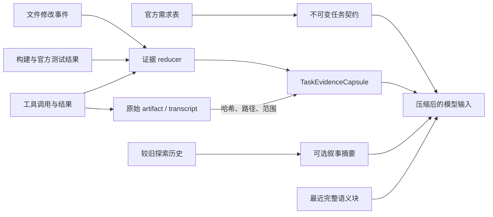

# H01 竞品调研：保留关键上下文证据

- 调研日期：2026-09-19
- Octos 基线：`c599d18c5acd2b846f049ffea2be84e72fe60fac`
- 调研对象：OpenAI Codex、Anthropic Claude Code、DeepSeek Harness

## 结论先行

H01 建议**调整后采用**。最有效的改法不是单纯把摘要提示词写得更长，而是把压缩后的上下文拆成三类：

1. **不可丢的任务契约**：当前需求 ID、原始验收条件、依赖、全局约束和固定测试协议，由 harness 保存并在压缩后重新注入；
2. **机器维护的证据胶囊**：实际改动、已验证行为、当前失败、原始证据引用和下一步，由可信事件确定性更新；
3. **可丢失的叙事摘要**：探索过程、解释和已放弃方案，只有这部分交给规则摘要或可选的模型摘要。

这样做首先保护测试通过率，其次才通过去重、外置长日志和减少重复调查来节省 token。当前没有任何一家竞品公开了与 ARC 相同任务、模型和预算下的通过率/token 对照数据，因此本文不填写虚构的百分比收益；收益必须由 Octos 自己的固定官方题目实验测量。

## 1. H01 到底解决什么问题

H01 处理的是：**信息曾经进入模型上下文，但长任务压缩后丢失或失真**。

它不解决以下问题：

- 某段需求从一开始就没有传给模型，这是 H11“统一完整需求的呈现”；
- 长工具输出已在更早阶段不可恢复地截断，这是 H03“分页、截断与原文恢复”；
- 测试失败后是否再给一次修复机会，这是 H06“验证失败后聚焦修复”。

这一区分很重要。摘要无法恢复从未进入上下文的场景、依赖或全局要求，也无法恢复已经丢弃的原始日志。

## 2. Octos 当前已经有什么

Octos 不是从零开始。当前实现已有几层可靠基础：

- `ContextManager` 保存规范化 transcript、语义块和压缩记录；工具输出还带哈希、原始 artifact 引用、可见内容和截断原因，见 [context_manager.rs](https://github.com/woshuoduijiushidui/octos-arc/blob/c599d18c5acd2b846f049ffea2be84e72fe60fac/crates/octos-cli/src/api/context_manager.rs#L321)；
- 语义压缩保留 system instructions、最新用户请求及其之后的内容，也不会把未闭合的工具调用从中间切开，见 [semantic_compaction_replacement_items](https://github.com/woshuoduijiushidui/octos-arc/blob/c599d18c5acd2b846f049ffea2be84e72fe60fac/crates/octos-cli/src/api/context_manager.rs#L3399)；
- 大工具结果可保存为 artifact，并用 call ID 找回，见 [record_tool_output_for_group](https://github.com/woshuoduijiushidui/octos-arc/blob/c599d18c5acd2b846f049ffea2be84e72fe60fac/crates/octos-cli/src/api/context_manager.rs#L2419)；
- 默认摘要会把最新 `update_plan` 快照单独置顶，并从摘要预算中预留空间，见 [compact_messages](https://github.com/woshuoduijiushidui/octos-arc/blob/c599d18c5acd2b846f049ffea2be84e72fe60fac/crates/octos-agent/src/compaction.rs#L95) 和 [latest_plan_snapshot](https://github.com/woshuoduijiushidui/octos-arc/blob/c599d18c5acd2b846f049ffea2be84e72fe60fac/crates/octos-agent/src/compaction.rs#L1205)；
- 可选模型摘要已经要求保留历史目标、关键决策、进展、剩余工作、约束、数据和路径，且明确让当前保留任务优先，见 [LLM compaction prompt](https://github.com/woshuoduijiushidui/octos-arc/blob/c599d18c5acd2b846f049ffea2be84e72fe60fac/crates/octos-agent/src/compaction.rs#L1250)。

因此，仅替换或扩写模型摘要提示词的边际收益有限；Octos 更缺的是不依赖模型判断、可由测试和工具事件直接维护的结构化证据层。

真正的薄弱点在默认 heuristic/fallback 使用的 extractive 摘要路径：

- 用户、assistant 和 system 消息只取第一行；
- 工具调用只留下工具名，不保留目标路径、命令或测试 ID；
- 工具结果只留第一行和最多 100 字符；
- 只有内容以 `Error:` 开头才标为错误；非零退出码、Playwright 失败或结构化失败可能被写成 `ok`；
- 按旧到新填充预算，旧信息可能先占满空间，较新的具体失败反而消失。

对应代码见 [summarize_message](https://github.com/woshuoduijiushidui/octos-arc/blob/c599d18c5acd2b846f049ffea2be84e72fe60fac/crates/octos-agent/src/compaction.rs#L284) 和 [旧到新预算循环](https://github.com/woshuoduijiushidui/octos-arc/blob/c599d18c5acd2b846f049ffea2be84e72fe60fac/crates/octos-agent/src/compaction.rs#L121)。现有测试也主要验证“出现工具名”“`Error:` 被识别”和总预算，没有覆盖需求后续行、测试断言、expected/actual、最近失败优先级及多次压缩后的证据完整性，见 [compaction tests](https://github.com/woshuoduijiushidui/octos-arc/blob/c599d18c5acd2b846f049ffea2be84e72fe60fac/crates/octos-agent/src/compaction.rs#L1804)。

另一个适用边界是 ARC 默认 `OCTOS_SESSION_SCOPE=turn`，每个外层生成/修复轮次通常重开 session，见 [arc/main.py](https://github.com/woshuoduijiushidui/octos-arc/blob/c599d18c5acd2b846f049ffea2be84e72fe60fac/arc/main.py#L748)。所以 H01 首先影响**单个较长的工具调用轮次**；配置为 `node` 或 `run` 时影响更大。外层下一轮是否重新带齐需求和失败证据，仍需由 ARC 编排器保证。

## 3. 竞品版本与证据边界

| 竞品 | 固定版本 | 可审计范围 | 与 Octos 的可比部分 |
| --- | --- | --- | --- |
| OpenAI Codex | [`78245b47`](https://github.com/openai/codex/commit/78245b47af2a7aafcabe025828ceecca69db4df1)，2026-09-19 | 完整公开 Rust 源码 | 压缩、稳定指令重建、用户消息保留、工具结果截断、持久 rollout |
| Claude Code | [`bf7d404e`](https://github.com/anthropics/claude-code/tree/bf7d404e26a5fb6167d21b46c93a2bf6c22ab274)，2026-09-19 | 官方文档、CHANGELOG、插件源码；CLI 核心未公开 | 压缩后的重新注入、transcript/tool-result 外置、hooks 生命周期 |
| DeepSeek Harness | [`ddefc45f`](https://github.com/deepseek-ai/deepseek-harness/commit/ddefc45fbc7f8e46dd73185e68295696d1297887)，`0.1.6-alpha.2` | 完整公开 TypeScript 源码；官方标为 developer preview | 分层压缩、结构化 checkpoint、append-only log、工具输出 spill、overflow 恢复 |

Claude Code 官方仓库的 README 只承诺其中包含扩展插件，[README](https://github.com/anthropics/claude-code/blob/bf7d404e26a5fb6167d21b46c93a2bf6c22ab274/README.md#L48-L50)；许可证为 all rights reserved，[LICENSE](https://github.com/anthropics/claude-code/blob/bf7d404e26a5fb6167d21b46c93a2bf6c22ab274/LICENSE.md#L1)。因此本文不会把文档行为反推成未公开的内部算法。`code.claude.com` 是滚动更新文档，本文引用的是 2026-09-19 的可见内容，不把它视为与仓库 commit 一一对应的快照。

DeepSeek Harness 是通用 coding-agent runtime，不是 ARC 的“需求表 → 实现 → 官方测试 → 验收”专用编排器。它的 goal 完成也没有独立 evaluator，[goal README](https://github.com/deepseek-ai/deepseek-harness/blob/ddefc45fbc7f8e46dd73185e68295696d1297887/packages/goal/goal/README.md#L151-L162)。可以借鉴上下文层，不能直接比较其“完成”与 ARC 测试通过。

## 4. 三家怎么做

### 4.1 OpenAI Codex：保留用户原话，稳定上下文重新构建

Codex 本地摘要提示词要求保留当前进展、关键决策、约束、用户偏好、未完成工作、下一步以及关键数据和引用，[compact prompt](https://github.com/openai/codex/blob/78245b47af2a7aafcabe025828ceecca69db4df1/codex-rs/prompts/templates/compact/prompt.md#L1-L9)。

更重要的是，它没有把所有责任交给摘要：

- 本地压缩从最新往前额外保留真实用户消息，总预算为 20,000 个估算 token；摘要作为最后一个 contextual user fragment 追加，[compact.rs](https://github.com/openai/codex/blob/78245b47af2a7aafcabe025828ceecca69db4df1/codex-rs/core/src/compact.rs#L687-L763)；
- base/system instructions 每次请求重新提供；developer instructions、AGENTS.md、环境和权限属于可重建的 initial context，[session/mod.rs](https://github.com/openai/codex/blob/78245b47af2a7aafcabe025828ceecca69db4df1/codex-rs/core/src/session/mod.rs#L4101-L4128)；
- mid-turn 压缩会把 canonical initial context 插回最后一个真实用户/agent 消息之前，其他压缩阶段让下一正常 turn 全量重注入，[compact.rs](https://github.com/openai/codex/blob/78245b47af2a7aafcabe025828ceecca69db4df1/codex-rs/core/src/compact.rs#L62-L110)；
- 工具文本采用中间截断，保留开头、结尾和显式省略标记，[truncate.rs](https://github.com/openai/codex/blob/78245b47af2a7aafcabe025828ceecca69db4df1/codex-rs/utils/string/src/truncate.rs#L11-L68)；缺失的工具结果会补 `aborted`，孤立结果会移除，删除历史时按 call/result 成对处理，[normalize.rs](https://github.com/openai/codex/blob/78245b47af2a7aafcabe025828ceecca69db4df1/codex-rs/core/src/context_manager/normalize.rs#L21-L145)。

Codex 还把完整 rollout 与模型可见的 replacement history 分开。压缩产生带精确 replacement history、window ID 和 token 状态的 checkpoint，原 rollout 不被原地覆盖，[session/mod.rs](https://github.com/openai/codex/blob/78245b47af2a7aafcabe025828ceecca69db4df1/codex-rs/core/src/session/mod.rs#L3936-L4009)。这让审计/恢复数据和模型短窗口承担不同职责。

需要注意两点：

- 官方 OpenAI/Azure provider 当前走服务端 Remote Compaction V2，本地产物可能是客户端不能解释的加密 compaction item，[provider.rs](https://github.com/openai/codex/blob/78245b47af2a7aafcabe025828ceecca69db4df1/codex-rs/model-provider/src/provider.rs#L410-L420) 和 [models.rs](https://github.com/openai/codex/blob/78245b47af2a7aafcabe025828ceecca69db4df1/codex-rs/protocol/src/models.rs#L1226-L1241)。Octos 不适合复制这个私有协议；
- Codex 没有专门的“失败测试账本”。失败用例、断言和改动文件仍主要依靠摘要、工具输出与磁盘工作区。

**对 Octos 的价值**：保留官方需求原话、重新构建稳定指令、把完整账本与短模型视图分离，值得借鉴。20K/64K 等固定预算和 Remote V2 不应照搬。

### 4.2 Claude Code：压缩后从磁盘重新注入重要状态

Claude Code 官方文档说明，compaction 使用一次单独模型请求，把历史替换成 summary；该请求复用相同 system prompt、tools 和会话前缀并在末尾追加摘要指令，[Prompt caching](https://code.claude.com/docs/en/prompt-caching#compacting-the-conversation)。

其核心思路也是把一部分状态移出自由文本摘要。压缩后：

- system prompt 和 output style 继续生效；
- 根 `CLAUDE.md`、无路径规则、auto memory 和 plan 从磁盘重新注入；
- path-scoped rules 和子目录指令在再次访问匹配文件时加载；
- 最多重读 5 个最近修改的已读/已编辑文件；大于 5,000 token 的文件只放路径引用；
- `SessionStart` 的 `compact` hook 会再次运行。

这些行为来自官方 [Context window](https://code.claude.com/docs/en/context-window#what-survives-compaction)。官方没有公开 structured summary 的字段，也没有承诺自动摘要一定保留最近失败或每条需求。

磁盘状态提供恢复线索：完整 session JSONL 记录消息、工具调用和结果，大工具输出可 spill 到 `tool-results/`，task list 也有独立目录，[`.claude` directory](https://code.claude.com/docs/en/claude-directory#what-claude-code-stores)。`PreCompact`/`PostCompact` 提供压缩前后生命周期，`SessionStart(compact)` 可以补充动态上下文，[Hooks](https://code.claude.com/docs/en/hooks#precompact)。

这里的限制也很明确：

- 核心实现未公开，不能声称复刻其摘要算法；
- todo/task 是工作进度，不是测试证据；
- auto memory 会跨 session/worktree，容易污染互相独立的基准题；
- 5 文件、5K token、200 行等都是 Claude Code 产品参数，不是 Octos 的实验结论。

**对 Octos 的价值**：压缩后重新注入 task-local 状态、长输出外置并保留引用、提供压缩生命周期检查点。不要使用跨题 memory 保存单题状态。

### 4.3 DeepSeek Harness：先无模型减量，再生成固定结构的 checkpoint

DeepSeek Harness 默认 base 组合会挂载 token meter、工具结果裁剪、自动压缩和 `/compact`，[base config](https://github.com/deepseek-ai/deepseek-harness/blob/ddefc45fbc7f8e46dd73185e68295696d1297887/packages/bundle/base/cordis.patch.yml#L324-L333)。当前通用默认值是 80% window 触发、原样保留最近 16%、摘要上限 8192 token、一次额外压缩和一次 overflow 恢复，[config.ts](https://github.com/deepseek-ai/deepseek-harness/blob/ddefc45fbc7f8e46dd73185e68295696d1297887/packages/compaction/compaction-basic/src/config.ts#L19-L35)。这些数值只能作为竞品事实，不能直接作为 Octos 参数。

它的摘要 prompt 比另外两家更严格，固定要求八个栏目：

- Primary Request and Intent；
- Key Technical Concepts；
- Files and Code；
- Errors and Fixes；
- Pending Jobs；
- Current Work；
- Next Step；
- Critical Context。

同时要求保留精确路径、命令、错误字符串、标识符、数字、函数签名和必要原话，[summarizer.ts](https://github.com/deepseek-ai/deepseek-harness/blob/ddefc45fbc7f8e46dd73185e68295696d1297887/packages/compaction/compaction-basic/src/summarizer.ts#L24-L66)。摘要若被 token cap 截断、没有文本或含图片则拒绝落地；摘要不比原区域小时也拒绝提交，[summarizer.ts](https://github.com/deepseek-ai/deepseek-harness/blob/ddefc45fbc7f8e46dd73185e68295696d1297887/packages/compaction/compaction-basic/src/summarizer.ts#L161-L218) 和 [region.ts](https://github.com/deepseek-ai/deepseek-harness/blob/ddefc45fbc7f8e46dd73185e68295696d1297887/packages/compaction/compaction-basic/src/region.ts#L387-L428)。

它同样不只依赖摘要：system head 不进入压缩范围；workspace instructions 被遮蔽后由 pre-step 重新加载，[region.ts](https://github.com/deepseek-ai/deepseek-harness/blob/ddefc45fbc7f8e46dd73185e68295696d1297887/packages/compaction/compaction-basic/src/region.ts#L108-L155) 和 [agent-instructions](https://github.com/deepseek-ai/deepseek-harness/blob/ddefc45fbc7f8e46dd73185e68295696d1297887/packages/context/agent-instructions/src/index.ts#L315-L340)。但普通用户需求仍主要依赖模型摘要，没有不可变 requirement ledger。

工具输出分两步处理：

1. 首次超过 inline 上限时把完整文本 spill 到 session 文件，模型看到 head/tail、遗漏量、路径和读取提示；存储失败则保留完整 inline 结果，[spill policy](https://github.com/deepseek-ai/deepseek-harness/blob/ddefc45fbc7f8e46dd73185e68295696d1297887/packages/spill/spill-policy/README.md#L47-L69)；
2. 历史压力出现后，再用无模型的 head/middle/tail 裁剪替换 model-visible surface，原事件仍留在 append-only log，[pruner](https://github.com/deepseek-ai/deepseek-harness/blob/ddefc45fbc7f8e46dd73185e68295696d1297887/packages/compaction/compaction-tool-result-pruner/src/index.ts#L124-L185)。

Overflow 恢复也有保护：先 prune，再压缩工具配对完整的最大前缀；只有 model-visible surface 的 replacement generation 真正推进后才重试，否则保留原 provider 错误，[compaction-basic](https://github.com/deepseek-ai/deepseek-harness/blob/ddefc45fbc7f8e46dd73185e68295696d1297887/packages/compaction/compaction-basic/src/index.ts#L176-L220)。

**对 Octos 的价值**：固定结构 checkpoint、确定性减量优先、摘要失败关闭、只有输入真的变小时才重试。其 Cordis 插件架构、人工 Plan Mode、256-round goal 和通用阈值都不适合直接搬入专用 ARC 链路。

## 5. 横向对比

| 问题 | Codex | Claude Code | DeepSeek Harness | Octos 应采用的答案 |
| --- | --- | --- | --- | --- |
| 稳定指令如何跨压缩 | base/system 每次提供，canonical initial context 重建 | 根指令、memory、plan 从磁盘重注入 | system head 不压缩，workspace instructions 按需重载 | 官方任务契约和运行政策作为 typed state 重注入 |
| 用户需求如何保护 | 另保留最近真实用户消息 | 聊天需求仍依赖摘要；静态指令可放文件 | 普通用户需求仍依赖摘要；goal objective 可重复注入 | 当前原子需求的验收条件确定性保留，不让摘要改写 |
| 摘要格式 | 四类交接要求，较宽松 | 未公开 | 八个固定栏目，要求精确工程细节 | 使用更短的 ARC 专用 schema，并由机器字段补齐 |
| 工具/日志如何减量 | 中间截断，保留首尾和状态；维护 call/result 配对 | 大结果可外置，完整 transcript 可回看 | 先 spill，后无模型裁剪，append-only log 不删 | 先结构化提取失败，再外置原文；保留 artifact 引用 |
| 当前工作状态 | 自然语言摘要；无测试专用账本 | plan/task 可持久，但不是验收证据 | todo/plan/goal 分离，但 goal 无独立 evaluator | 工作状态和官方测试状态分离，测试 runner 才能写 pass |
| 压缩失败怎么办 | 路径不同；Remote V2 较事务化，本地仍有边界 | 核心实现未知，可用 hooks 观测 | 截断/空摘要拒绝；不变小则拒绝；有界恢复 | candidate 校验、持久化成功后再原子安装 |
| 是否有可比效果数据 | 无 ARC 可比公开数据 | 无 | 无 | 必须用固定官方题目做 A/B 与重复运行 |

三家共同点不是“用了某个神奇摘要 prompt”，而是：**稳定事实不完全交给摘要、长原文和模型可见视图分离、压缩后仍有恢复路径**。

## 6. 适合 Octos 的目标设计



### 6.1 不可变任务契约

对当前原子需求，至少保留：

- `requirement_id`、name、description；
- GIVEN/WHEN/THEN 或等价验收条件；
- dependencies 和仍适用的祖先/全局约束；
- 官方 spec 的允许使用方式和“不得修改测试”等 policy；
- 规范化需求的 `sha256` 和持久化路径。

小型当前需求可以原文重注入。需求较大时，仍应原文保留当前节点的验收条件；全表放稳定引用和哈希，按依赖/当前节点加载相关部分。不能仅保留模型自己改写后的“需求理解”。

### 6.2 `TaskEvidenceCapsule`

建议使用 typed、可序列化结构，而不是拼接一段自由文本：

```yaml
schema: octos.task-evidence.v1
task:
  requirement_id: REQ-2
  contract_sha256: "..."
  phase: repair
changes:
  - path: frontend/src/App.tsx
    purpose: add reset behavior without changing increment/decrement
    content_sha256: "..."
verification:
  run_id: "..."
  command: "npx playwright test REQ-2.spec.ts"
  exit_code: 1
  passed: 3
  failed: 1
active_failures:
  - test_id: "REQ-2 resets the counter"
    location: "REQ-2.spec.ts:27"
    expected: "0"
    actual: "2"
    signature: "sha256:..."
    occurrences: 2
    artifact_ref: ".arc/evidence/.../playwright.log"
verified_behaviors:
  - requirement_id: REQ-1
    run_id: "..."
    result: passed
next_action: "Trace the reset click handler and rerun REQ-2 only."
```

写入权限应分开：

- 需求契约只能由需求解析器写；
- `passed/failed`、exit code 和断言只能由 build/acceptance runner 写；
- 文件列表和哈希由文件工具或工作区扫描写；
- 模型可以提出 `next_action`，但不能把自己的 `completed` 当作测试通过。

需求可能回归，因此不要把 `passed` 做成永久单调状态。每条结论都带 `run_id`、时间/顺序和对应源码哈希；代码变化后，旧 pass 只表示“曾在那一版本通过”。

### 6.3 证据选择规则

在相同预算下按下面顺序保留：

1. 当前需求的精确验收条件和禁止事项；
2. 当前未解决失败：test ID、位置、错误类型、expected/actual、相关操作步骤；
3. 最近一次验证结果和仍有效的已通过行为；
4. 已修改文件、接口决策和内容哈希；
5. 单一下一步和 blocker；
6. 叙事历史。

相同失败用 `test_id + location + error class + expected/actual` 规范化后计算 signature。重复出现只增加次数并更新最后一次 run；失败发生变化时保留新 signature。完整堆栈、测试日志和大文件内容留在 artifact 中，需要时按引用读取。

### 6.4 压缩策略

建议顺序：

1. 去除或折叠重复成功日志和已失效中间输出；
2. 对长工具结果生成短视图，但先保存原文和恢复引用；
3. 安装任务契约和证据胶囊；
4. 保留最新用户请求、未闭合工具组及最近完整语义块；
5. 若仍超预算，再对剩余叙事历史做一次模型摘要。

默认路径不需要为每次压缩新增模型调用。Octos 已有 opt-in LLM compaction，可保留为最后一层；若启用，应输出固定 schema，检查必填字段、完整结束状态和“确实小于原内容”，缺字段由证据胶囊补回。不能在模型摘要失败后悄悄安装半个 checkpoint。

### 6.5 安装与恢复

压缩应在独立 candidate 中完成：

1. 选定可压缩的完整语义块；
2. 构建摘要、任务契约和 capsule；
3. 校验当前 requirement、active failures、tool pairing 和 artifact 引用；
4. 先持久化 checkpoint；
5. 最后原子切换 model-visible history。

只有输入 fingerprint 或 token estimate 明确变小，overflow 才允许重试。压缩、rate-limit 和普通 transport retry 分开计数与计费。

## 7. 建议拆成的最小改动

| 子项 | 改动 | 预计通过率方向 | token 方向 | 成本/风险 | 决策 |
| --- | --- | --- | --- | --- | --- |
| H01a | 增加 task-local typed `TaskEvidenceCapsule`，压缩后确定性重注入 | 高：保护需求、最近失败和已验证行为 | 小幅固定输入；有望减少重复调查 | 中；需定义可信写入者 | **P0 采用** |
| H01b | 默认摘要从“逐条首行、旧到新”改为证据优先；按结构化状态识别失败 | 中到高：减少具体失败消失 | 基本持平或下降 | 低到中；可复用现有摘要器 | **P0 采用** |
| H01c | 保留精确当前需求；大需求使用规范化原文引用与哈希 | 高：减少约束失真 | 可能增加每轮固定输入 | 中；必须与 H11 对齐 | **P0 采用** |
| H01d | 长日志原文外置，capsule 只保留失败字段和可恢复引用 | 中：保留诊断路径 | 有望明显减少重复日志 | 中；恢复工具属于 H03 | **与 H03 联动采用** |
| H01e | LLM 生成固定结构 checkpoint，并校验字段 | 中：可改善复杂叙事摘要 | 增加摘要请求；净收益未知 | 中到高；模型仍可能遗漏 | **后置、可选** |
| H01f | 照搬竞品固定阈值、todo/goal 或完整插件架构 | 无可靠依据 | 未知 | 高；与 ARC 流程不匹配 | **不采用** |

最小落点可以复用现有结构：

- 在 [context_manager.rs](https://github.com/woshuoduijiushidui/octos-arc/blob/c599d18c5acd2b846f049ffea2be84e72fe60fac/crates/octos-cli/src/api/context_manager.rs#L453) 的 typed transcript/compaction policy 中加入 task evidence item 或等价 pinned fragment；
- 在 [compaction.rs](https://github.com/woshuoduijiushidui/octos-arc/blob/c599d18c5acd2b846f049ffea2be84e72fe60fac/crates/octos-agent/src/compaction.rs#L95) 像 plan snapshot 一样从预算中预留 evidence block，并把 fallback 改为按证据优先级选取；
- 由 ARC 的 requirement parser、文件变更记录和 acceptance runner 生成可信字段；通用 ContextManager 不用猜 Playwright 文本；
- 保持现有 canonical transcript、semantic block、tool artifact 和 recall 机制，不重写整套上下文系统。

## 8. 对照实验

### 8.1 先做确定性测试

1. 多行需求的重要约束位于第二行以后，强制压缩后仍逐字存在；
2. 大量旧对话后出现最新测试失败，预算很小时仍保留 test ID、位置、expected/actual；
3. 工具内容不以 `Error:` 开头，但结构化 exit code 非零，必须记录为失败；
4. 工具调用保留经过 allowlist 的目标路径/测试命令，不泄露任意未信任参数；
5. 同一失败重复三次只占一个 active failure 条目，并保留次数和最新 run；
6. 代码修改后原有 pass 变成 regression，capsule 显示新结果，不把历史 pass 当当前真值；
7. 连续压缩两次，prior summary、plan 和 capsule 不重复膨胀；
8. 摘要超限、空结果、缺字段、provider error 和持久化失败时，原 model-visible history 不被半替换；
9. tool call/result 配对、最新用户请求和 system instructions 继续满足现有不变量。

### 8.2 用固定官方任务做三臂 A/B/C

| 组别 | 策略 |
| --- | --- |
| A | 当前默认 extractive 摘要 |
| B | H01a–d：typed capsule + 确定性证据优先摘要 + artifact 引用，不增加模型调用 |
| C | B + H01e：可选 LLM structured checkpoint，使用独立实验分支 |

固定需求、官方测试、模型、推理参数、请求/修复预算、模板和运行环境。小题重复多次；长题至少覆盖会真正触发压缩的工具模式，并分别记录 `turn`、`node`、`run` scope。

指标按既定目标排序：

1. 最终官方测试通过数、全通过率和重复运行稳定性；
2. 压缩后需求约束保留率、active failure 字段保留率、错误重复次数；
3. 全任务 provider 输入/输出/cache/reasoning token，包含摘要、失败请求和重试；
4. 模型请求数、压缩次数、重复读文件/日志次数、修复轮数、耗时；
5. artifact 找回成功率、checkpoint 恢复一致率和半写入次数。

若 C 的通过数不优于 B，却多消耗一次模型摘要，应保留 B 作为默认。只有在通过数先不下降时，才能用 token 减少作为采用理由。完整分支、实现和实验清单见 [H01 实施 Milestone](./h01-implementation-milestone.md)。

## 9. 最终判断

H01 值得做，但应把名称从泛化的“改进摘要”理解为：

> **建立一个由 harness 维护、可验证、可恢复的任务证据胶囊；摘要只负责压缩不影响验收的叙事历史。**

推荐实施顺序是 H01a → H01b → H01c，并与 H03 共用 artifact 引用。LLM structured checkpoint 放在确定性方案之后。这样利用 Octos 已有的 typed transcript、语义块、plan snapshot 和 tool artifact，改动集中，也更符合“通过更多官方测试优先、总 token 次之”的目标。
