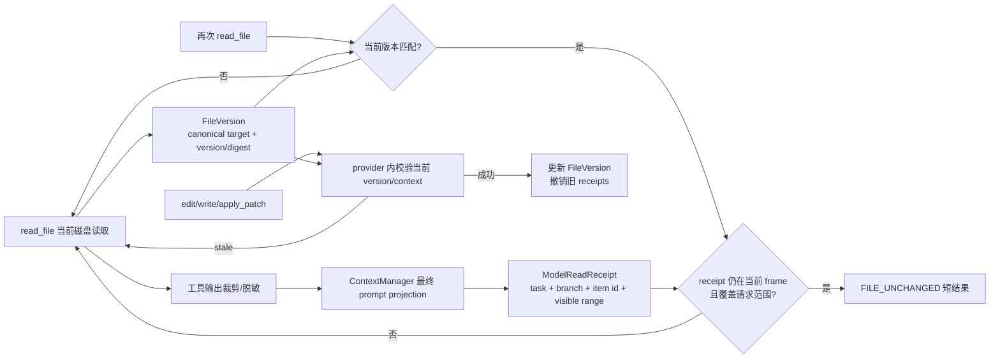

# H02 竞品调研：文件缓存与模型可见内容一致

- 调研日期：2026-09-20
- Octos 分析基线：`c599d18c5acd2b846f049ffea2be84e72fe60fac`
- 当前工作区复核版本：`804e42a8d42b5e570a5d1d2cb78b01d0a73059d7`（H01 实验分支；本文的 H02 源码结论仍以清单声明的基线为准）
- 调研对象：Anthropic Claude Code、OpenAI Codex、DeepSeek Harness

## 结论先行

H02 建议**调整后采用**，但不能先把现有 `FileStateCache` 接到所有 Agent 构造路径。当前缓存把两个不同事实混成了一个：

1. **磁盘事实**：文件是否仍是模型读取时的那个版本；
2. **上下文事实**：那个版本、那个范围的正文是否仍在当前模型实际可见的 prompt 中。

只有两者同时成立，`read_file` 才能安全返回 `[FILE_UNCHANGED]`。建议把命中条件固定为：

```text
can_return_unchanged =
    same_task_and_model_branch
    && current_file_version == receipt.file_version
    && requested_view is covered by receipt.model_visible_view
    && receipt.source_item_id is present in the current prompt frame
```

任一条件无法证明时都返回当前正文；磁盘 I/O 可以多做一次，不能为了少输入 token 给模型一个没有正文可回看的空提示。

三家竞品分别提供了不同部分的答案：

- Claude Code 公开行为最接近 H02：未变化重读会去重，但压缩后会重新从磁盘注入少量文件；其 CHANGELOG 也记录了 rewind/resume 后 file-read tracking 串到错误历史的修复，说明可见性生命周期不能只按路径维护；
- Codex 在固定版本中没有同类模型侧 `Read` 去重缓存，值得借鉴的是 `apply_patch` 在执行阶段重新读取当前磁盘并匹配旧上下文，匹配失败就拒绝写入；
- DeepSeek Harness 把 session 内“已观察版本”与 provider 内版本 guard 做成明确协议，能处理外部修改和并发写，但它证明的是 freshness，不证明正文仍在模型视图中。

因此适合 Octos 的组合不是复制某一家，而是：**DeepSeek 式版本观察与 typed stale recovery + Claude 式上下文生命周期/压缩后回灌 + Codex 式执行时基于当前磁盘失败关闭**。

当前主 stdio 和 MCP 路径实际上没有完整启用缓存，这虽然没有节省重复输入，却比“直接接上旧缓存”更安全。实施顺序必须是先修正缓存语义和隔离，再补接线。三家都没有公开与 Octos ARC 相同任务、模型和预算下的 H02 通过率/token 对照数据；本文不沿用当前源码注释中的“30–60%”收益，实际收益必须由固定官方任务实验测量。

## 1. H02 到底解决什么问题

H02 处理的是：**模型再次读取文件时，什么时候可以省略正文，同时仍保证它能依据当前、可见的代码做修改。**

“文件没有变化”并不等于“模型仍看得见文件”。旧正文可能已经被：

- context window trimming 删除；
- compaction summary 替换；
- tool output 的 100KB、50KB、8KiB 多层限制裁剪；
- rewind、resume、fork 或任务切换排除；
- 留在子 Agent 的独立上下文中，从未进入父 Agent 的 prompt。

反过来，“旧正文仍在 transcript 或 artifact 中”也不等于“磁盘仍是旧版本”。shell、formatter、测试进程、git 操作和外部编辑器都可能绕过内置文件工具的 cache invalidation。

H02 不负责以下问题：

- 如何分页、标记截断并恢复大文件原文，这是 H03；
- 如何在压缩后保留需求、失败和验证证据，这是 H01；
- MCP task loop 是否完整触发通用压缩策略，这是 H04；
- 何时选择局部编辑而不是整文件覆盖，这是 H05。

这些项目会共享事件和元数据，但不能用 H02 的一个布尔 cache hit 替代各自协议。尤其是：artifact 引用能帮助 H03 恢复正文，却不能证明该正文已经在本次模型请求中可见。

ARC 默认链路是 Python Flow 启动 `octos serve --stdio --solo`，通过 `session/open` 和 `turn/start` 驱动 OUP，[octos_stdio.py](https://github.com/woshuoduijiushidui/octos-arc/blob/c599d18c5acd2b846f049ffea2be84e72fe60fac/arc/octos_stdio.py#L1-L6)；默认 `OCTOS_SESSION_SCOPE=turn`，[main.py](https://github.com/woshuoduijiushidui/octos-arc/blob/c599d18c5acd2b846f049ffea2be84e72fe60fac/arc/main.py#L748)。所以 H02 在默认配置下首先影响单个较长工具 turn；`node` 或 `run` scope 才会让错误命中跨更多外层轮次累积。

## 2. Octos 当前已经有什么

Octos 已有可复用的基础：

- 每个 `SessionRuntime` 会创建一个 `Arc<FileStateCache>`，并挂到 bootstrap Agent，[session.rs](https://github.com/woshuoduijiushidui/octos-arc/blob/c599d18c5acd2b846f049ffea2be84e72fe60fac/crates/octos-cli/src/runtime/session.rs#L421-L429) 和 [Agent 接线](https://github.com/woshuoduijiushidui/octos-arc/blob/c599d18c5acd2b846f049ffea2be84e72fe60fac/crates/octos-cli/src/runtime/session.rs#L577-L608)；
- cache entry 已保存绝对路径、mtime、content hash、大小、partial 标记和 view range，[CacheEntry](https://github.com/woshuoduijiushidui/octos-arc/blob/c599d18c5acd2b846f049ffea2be84e72fe60fac/crates/octos-agent/src/file_state_cache.rs#L65-L82)；
- `read_file` 会记录实际 clamped range，避免把明确的窗口读取直接当成全文读取，[read_file cache put](https://github.com/woshuoduijiushidui/octos-arc/blob/c599d18c5acd2b846f049ffea2be84e72fe60fac/crates/octos-agent/src/tools/read_file.rs#L682-L709)；
- `edit_file`、`write_file` 和 `diff_edit` 成功后会主动失效对应路径，[edit_file](https://github.com/woshuoduijiushidui/octos-arc/blob/c599d18c5acd2b846f049ffea2be84e72fe60fac/crates/octos-agent/src/tools/edit_file.rs#L354-L358)、[write_file](https://github.com/woshuoduijiushidui/octos-arc/blob/c599d18c5acd2b846f049ffea2be84e72fe60fac/crates/octos-agent/src/tools/write_file.rs#L583-L588)、[diff_edit](https://github.com/woshuoduijiushidui/octos-arc/blob/c599d18c5acd2b846f049ffea2be84e72fe60fac/crates/octos-agent/src/tools/diff_edit.rs#L172-L176)；`apply_patch` 对每个候选路径不论结果都执行失效，[apply_patch](https://github.com/woshuoduijiushidui/octos-arc/blob/c599d18c5acd2b846f049ffea2be84e72fe60fac/crates/octos-agent/src/tools/apply_patch.rs#L490-L574)；
- opt-in 的 armed read-window 路径已有更严格的 view ledger：按 session 记录实际 byte coverage、文件 epoch，并在 sanitizer 改写或二进制转文本时标记 tainted/transformed，[read_file view ledger](https://github.com/woshuoduijiushidui/octos-arc/blob/c599d18c5acd2b846f049ffea2be84e72fe60fac/crates/octos-agent/src/tools/read_file.rs#L711-L739)；`write_file` 会拒绝 partial、tainted、transformed 或 epoch 已变化的整文件覆盖，[write_file view guard](https://github.com/woshuoduijiushidui/octos-arc/blob/c599d18c5acd2b846f049ffea2be84e72fe60fac/crates/octos-agent/src/tools/write_file.rs#L245-L379)，并用 epoch-bound `write_no_follow_checked` 防止 authorize 到 truncate 之间的 inode 替换，[checked write](https://github.com/woshuoduijiushidui/octos-arc/blob/c599d18c5acd2b846f049ffea2be84e72fe60fac/crates/octos-agent/src/tools/write_file.rs#L512-L547)；
- ContextManager 已有 transcript item ID、generation、model-visible tool output 和 truncation reason，可作为可见 receipt 的事实来源，[ToolOutputEnvelope](https://github.com/woshuoduijiushidui/octos-arc/blob/c599d18c5acd2b846f049ffea2be84e72fe60fac/crates/octos-cli/src/api/context_manager.rs#L321-L335) 和 [ToolOutputPolicy](https://github.com/woshuoduijiushidui/octos-arc/blob/c599d18c5acd2b846f049ffea2be84e72fe60fac/crates/octos-cli/src/api/context_manager.rs#L344-L357)。

但当前实现有五个会影响正确性的缺口。

### 2.1 命中只验证 mtime，没有验证已经保存的 content hash

`FileStateCache::get` 只比较缓存 mtime 和调用方传入的当前 mtime，[get](https://github.com/woshuoduijiushidui/octos-arc/blob/c599d18c5acd2b846f049ffea2be84e72fe60fac/crates/octos-agent/src/file_state_cache.rs#L189-L202)。`read_file` 在读取正文之前 stat 文件，mtime 相等且 range 匹配就直接返回 stub，[read_file hit](https://github.com/woshuoduijiushidui/octos-arc/blob/c599d18c5acd2b846f049ffea2be84e72fe60fac/crates/octos-agent/src/tools/read_file.rs#L367-L405)。

虽然 cache put 会计算整个 `content` 的 FNV-1a hash，但命中路径没有重新计算或比较它。因此同一时间粒度内的快速覆盖、恢复旧 mtime、某些同大小替换都可能错误命中。内置写工具的主动 invalidation 只能覆盖它们自己执行的写入，不能替代对 shell、formatter、测试进程和外部编辑器的版本核验。

### 2.2 cache 的“全文”早于模型最终可见投影

`read_file` 先把无 window 输出截到 100KB，再写 cache；没有显式 range 的请求仍可能记录 `view_range=None`，[read_file truncation and put](https://github.com/woshuoduijiushidui/octos-arc/blob/c599d18c5acd2b846f049ffea2be84e72fe60fac/crates/octos-agent/src/tools/read_file.rs#L675-L707)。之后统一执行层还会把 `read_file` 输出限制到 50KB，[tool_output_limit](https://github.com/woshuoduijiushidui/octos-arc/blob/c599d18c5acd2b846f049ffea2be84e72fe60fac/crates/octos-core/src/utils.rs#L180-L196) 和 [execution truncation](https://github.com/woshuoduijiushidui/octos-arc/blob/c599d18c5acd2b846f049ffea2be84e72fe60fac/crates/octos-agent/src/agent/execution.rs#L2394-L2426)；AppUI ContextManager 默认 model-visible tool output 上限又是 8KiB，[context_manager constants](https://github.com/woshuoduijiushidui/octos-arc/blob/c599d18c5acd2b846f049ffea2be84e72fe60fac/crates/octos-cli/src/api/context_manager.rs#L20-L25)。

所以当前可能出现：模型只看过文件开头和结尾，cache 却在下一次返回“full file cached”。H02 必须在所有裁剪、脱敏和 prompt projection **之后**登记实际可见覆盖；分页与丢失内容的恢复方式仍由 H03 定义。

### 2.3 compaction 清 cache 的 helper 没有进入实际生产链路

`run_tier3_and_invalidate_cache` 已明确知道 tier-3 会剪掉支撑 `[FILE_UNCHANGED]` 的旧 tool result，并选择清空 cache，[compaction_tiered.rs](https://github.com/woshuoduijiushidui/octos-arc/blob/c599d18c5acd2b846f049ffea2be84e72fe60fac/crates/octos-agent/src/compaction_tiered.rs#L716-L744)。但在该基线中源码搜索只发现集成测试调用，[m8_integration_cache_handoff.rs](https://github.com/woshuoduijiushidui/octos-arc/blob/c599d18c5acd2b846f049ffea2be84e72fe60fac/crates/octos-agent/tests/m8_integration_cache_handoff.rs#L55-L91)。

实际 loop 的 trimming 和旧工具结果截断没有同步处理 file cache，[loop_compaction.rs](https://github.com/woshuoduijiushidui/octos-arc/blob/c599d18c5acd2b846f049ffea2be84e72fe60fac/crates/octos-agent/src/agent/loop_compaction.rs#L27-L60)。因此不能把 helper 的存在当作生产保护已经生效。

### 2.4 实际 stdio、MCP Agent 构造没有完整接入 cache

OUP 每个 turn 从 `Agent::new_shared` 重建 `request_agent`，显式传播了 config、system prompt、prompt-cache epoch、session usage、session key 和 reporter，却没有传播 `file_state_cache`，[ui_protocol_transport.rs](https://github.com/woshuoduijiushidui/octos-arc/blob/c599d18c5acd2b846f049ffea2be84e72fe60fac/crates/octos-cli/src/api/ui_protocol_transport.rs#L34601-L34617)。同一段代码后来还专门重新传播 hook context 和 session scope，说明这种 per-turn rebuild 的字段不能假定自动继承，[rebuild follow-up](https://github.com/woshuoduijiushidui/octos-arc/blob/c599d18c5acd2b846f049ffea2be84e72fe60fac/crates/octos-cli/src/api/ui_protocol_transport.rs#L34742-L34758)。

MCP `run_session` 也会新建 Agent 并只接入 config 等状态，没有 file cache，[mcp_serve.rs](https://github.com/woshuoduijiushidui/octos-arc/blob/c599d18c5acd2b846f049ffea2be84e72fe60fac/crates/octos-cli/src/commands/mcp_serve.rs#L523-L605)。所以当前 H02 的 token 收益并没有稳定覆盖这两条目标路径。

但接线缺失目前也阻止了一部分错误命中。不能把“补 `.with_file_state_cache(...)`”单独作为修复；必须先建立下面的可见性和隔离契约。

### 2.5 父子 Agent 共享同一个 cache，违反模型上下文隔离

cache 已提供 `clone_for_subagent`，注释要求父子使用独立 snapshot，[file_state_cache.rs](https://github.com/woshuoduijiushidui/octos-arc/blob/c599d18c5acd2b846f049ffea2be84e72fe60fac/crates/octos-agent/src/file_state_cache.rs#L313-L328)。但同步和后台 spawn 实际都把同一个 `Arc<FileStateCache>` clone 给 child，[sync spawn](https://github.com/woshuoduijiushidui/octos-arc/blob/c599d18c5acd2b846f049ffea2be84e72fe60fac/crates/octos-agent/src/tools/spawn.rs#L3980-L3987) 和 [background spawn](https://github.com/woshuoduijiushidui/octos-arc/blob/c599d18c5acd2b846f049ffea2be84e72fe60fac/crates/octos-agent/src/tools/spawn.rs#L4606-L4612)。

直接反例是：child 读取文件后写入共享 cache；parent 随后读取相同路径，可能收到“Use the previous tool result”，但 parent 的模型上下文从未包含 child 的原始 tool result。父子可以共享磁盘版本服务，不能共享“这个模型已经见过正文”的 receipt。

最后，当前文件顶部注释声称实现 mirrors Claude Code、可节省 30–60% token，并把 100 entries/25MB 写成 Claude 参数，[file_state_cache.rs](https://github.com/woshuoduijiushidui/octos-arc/blob/c599d18c5acd2b846f049ffea2be84e72fe60fac/crates/octos-agent/src/file_state_cache.rs#L1-L35)。Claude Code CLI 核心未公开，本文不把这些注释当作已核实的竞品实现或效果证据。

## 3. 竞品版本与证据边界

| 竞品 | 固定版本 | 可审计范围 | 与 H02 的可比部分 |
| --- | --- | --- | --- |
| Claude Code | [`bf7d404e`](https://github.com/anthropics/claude-code/tree/bf7d404e26a5fb6167d21b46c93a2bf6c22ab274)，v2.1.278，2026-09-19 | 官方 README、文档、CHANGELOG 和插件；CLI 核心未公开 | 重复读取去重、file-read tracking 生命周期、压缩后的文件重新注入 |
| OpenAI Codex | [`5c5308fc`](https://github.com/openai/codex/commit/5c5308fc9a9ee789049d646ef11e5400384b9c6f)，2026-09-20 | 完整公开 Rust 源码和测试 | 默认读取路径、执行时重新读取当前文件、patch 上下文校验 |
| DeepSeek Harness | [`ddefc45f`](https://github.com/deepseek-ai/deepseek-harness/commit/ddefc45fbc7f8e46dd73185e68295696d1297887)，`0.1.6-alpha.2`，2026-09-17 | 完整公开 TypeScript 源码、README 和测试；官方仍标为 developer preview | session-scoped observation、opaque version、provider guard、typed stale recovery |

Claude Code 仓库 README 只说明仓库包含扩展插件，[README](https://github.com/anthropics/claude-code/blob/bf7d404e26a5fb6167d21b46c93a2bf6c22ab274/README.md#L48-L50)。因此本文只描述可见产品行为，不猜测其内部用 mtime、size、hash、watcher 还是组合算法。`code.claude.com` 是滚动文档；本文记录 2026-09-20 可见内容，并不声称它与仓库 commit 构成源码快照。

Codex 和 DeepSeek Harness 都是通用 coding-agent runtime，不是 ARC 的“固定需求 → 生成/修改 → 官方测试 → 修复”专用编排器。机制可以迁移，公开结果不能直接换算成 Octos 的通过率或 token 收益。

## 4. 三家怎么做

### 4.1 Claude Code：去重读取，但把 file-read tracking 视为 conversation lifecycle 状态

Claude Code 官方 CHANGELOG 明确写过：`Read` 使用更紧凑的行号格式并去重未变化的重复读取，以减少 token，[CHANGELOG](https://github.com/anthropics/claude-code/blob/bf7d404e26a5fb6167d21b46c93a2bf6c22ab274/CHANGELOG.md#L4560-L4564)。它还把 file edit read cache 从“最多保留 1,000 个完整文件”改为总计 16MB，[CHANGELOG](https://github.com/anthropics/claude-code/blob/bf7d404e26a5fb6167d21b46c93a2bf6c22ab274/CHANGELOG.md#L2265-L2271)。这些是产品事实，不公开 cache key、淘汰策略或未变化判断算法。

更重要的是，Claude Code 没有把压缩后的旧 read tracking 当作仍然可见。官方 context window 文档说明，compaction 后会从磁盘重新读取本会话读过或编辑过的文件，最多 5 个，按最近修改时间选择；超过 5,000 token 的文件只重新放入路径引用而不是正文，[Context window](https://code.claude.com/docs/en/context-window#what-survives-compaction)。这相当于显式区分“历史上读过”和“压缩后模型仍拿到正文”。

CHANGELOG 还公开了几个直接对应 H02 的生命周期缺陷与修复：

- `/rewind` 曾保留被 rewind 掉的 file-read tracking，造成 `File unchanged since last read` stub 与外部修改后的全文重新注入错位，[CHANGELOG](https://github.com/anthropics/claude-code/blob/bf7d404e26a5fb6167d21b46c93a2bf6c22ab274/CHANGELOG.md#L898-L900)；
- `/resume` 和 `/teleport` 曾沿用上一 conversation 的 tracking，使模型能编辑当前 conversation 从未读取的文件，[CHANGELOG](https://github.com/anthropics/claude-code/blob/bf7d404e26a5fb6167d21b46c93a2bf6c22ab274/CHANGELOG.md#L415-L420)；
- partial read 在 resume 后是否仍算已读也有专门修复，[CHANGELOG](https://github.com/anthropics/claude-code/blob/bf7d404e26a5fb6167d21b46c93a2bf6c22ab274/CHANGELOG.md#L2123-L2125)。

这些修复不能证明其内部数据结构，但足以证明：file-read tracking 至少要绑定 conversation/history lifecycle，不能是 workspace 内按路径共享的永久布尔值。

Claude Code 也公开了 `FileChanged` hook，可用文件系统 watcher 观察 `Edit`、`Write`、Bash 和外部进程造成的变化；但它只监听显式配置的文件，并且是修改后的通知，不能阻止已经发生的写入，[Hooks: FileChanged](https://code.claude.com/docs/en/hooks#filechanged)。因此 watcher 适合做主动 invalidation/观测，不足以替代每次关键命中或写入时的版本校验。

**对 Octos 的价值**：采用“重复读取可去重，但压缩/rewind/resume 后重新建立模型可见证据”的原则；可以实验少量热点文件回灌。不要照搬 5 文件、5,000 token、16MB 等产品参数，也不要声称复刻其未公开缓存算法。

### 4.2 OpenAI Codex：默认不做同类 Read 去重，写入时重新匹配当前磁盘

在固定提交的默认 core tool plan 中，Codex 注册 shell、MCP resource、utility 和 collaboration tools，[add_core_tool_sources](https://github.com/openai/codex/blob/5c5308fc9a9ee789049d646ef11e5400384b9c6f/codex-rs/core/src/tools/spec_plan.rs#L968-L989)；文件检查主要通过每次实际执行的 `exec_command`，同时注册 `write_stdin`，[add_shell_tools](https://github.com/openai/codex/blob/5c5308fc9a9ee789049d646ef11e5400384b9c6f/codex-rs/core/src/tools/spec_plan.rs#L1031-L1071)，以及可选 `apply_patch`，[utility tools](https://github.com/openai/codex/blob/5c5308fc9a9ee789049d646ef11e5400384b9c6f/codex-rs/core/src/tools/spec_plan.rs#L1094-L1215)。源码审计未发现 Claude/Octos 风格的默认模型侧 `Read` 内容去重与 no-content stub。

所以 Codex 没有可以直接复制给 H02 的 `FILE_UNCHANGED` 算法。它更值得借鉴的是 mutation-time freshness：

1. `apply_patch` handler 先在所选 environment 的当前文件系统上验证 patch，[handler](https://github.com/openai/codex/blob/5c5308fc9a9ee789049d646ef11e5400384b9c6f/codex-rs/core/src/tools/handlers/apply_patch.rs#L381-L428)；
2. 真正执行时仍把原始 patch 交给 apply runtime，而不是直接落盘预验证阶段缓存的 `new_content`，[runtime](https://github.com/openai/codex/blob/5c5308fc9a9ee789049d646ef11e5400384b9c6f/codex-rs/core/src/tools/runtimes/apply_patch.rs#L168-L198)；
3. 执行层重新读取目标文件，再在当前内容中计算 replacements，[file_update.rs](https://github.com/openai/codex/blob/5c5308fc9a9ee789049d646ef11e5400384b9c6f/codex-rs/apply-patch/src/file_update.rs#L24-L82)；
4. 当前内容找不到预期旧行时，返回带路径和 expected lines 的失败，而不是覆盖未知新版本，[failure](https://github.com/openai/codex/blob/5c5308fc9a9ee789049d646ef11e5400384b9c6f/codex-rs/apply-patch/src/file_update.rs#L208-L215)。

其匹配语义不是“整文件 digest 必须相等”：依次允许精确匹配、忽略尾空白、忽略两端空白和部分 Unicode 标点归一化，[seek_sequence.rs](https://github.com/openai/codex/blob/5c5308fc9a9ee789049d646ef11e5400384b9c6f/codex-rs/apply-patch/src/seek_sequence.rs#L1-L114)。这适合局部 patch：文件其他区域即使被外部修改，只要目标上下文仍能匹配，就不必拒绝整个 patch。该实现找到第一个匹配即返回，不证明唯一性；“必须唯一匹配”是本文建议 Octos 增加的更强约束，不是 Codex 现状。

测试覆盖了几个重要失败边界：审批等待期间目标换成 symlink 时，执行阶段重新读取并拒绝，外部文件不被修改，[symlink swap test](https://github.com/openai/codex/blob/5c5308fc9a9ee789049d646ef11e5400384b9c6f/codex-rs/core/tests/suite/apply_patch_cli.rs#L1152-L1235)；patch 预验证失败时，前面的 Add 也不产生部分副作用，[no side effects test](https://github.com/openai/codex/blob/5c5308fc9a9ee789049d646ef11e5400384b9c6f/codex-rs/core/tests/suite/apply_patch_cli.rs#L1521-L1539)；旧行不匹配时返回诊断且原文件保持不变，[mismatch test](https://github.com/openai/codex/blob/5c5308fc9a9ee789049d646ef11e5400384b9c6f/codex-rs/core/tests/suite/apply_patch_cli.rs#L2088-L2134)。

边界也要保留：这里没有展示基于内容 hash 的原子 compare-and-swap，重新读取与最终写入之间仍有短竞争窗口；普通 shell 写入也不经过 `apply_patch` 保护。

**对 Octos 的价值**：模型历史只能帮助生成 edit intent，执行时仍要对当前文件重新校验；局部 edit 用唯一旧文本/patch context，整文件覆盖用 expected version/digest。不能因为 Codex 没有同类 Read 缓存，就放弃 Octos 在长 ARC 工具 turn 中安全减少重复输入的机会。

### 4.3 DeepSeek Harness：session-scoped observation + provider version guard

DeepSeek Harness 默认 base bundle 会在 `tool-fs` 前挂载 `fs-observation-policy`，[base config](https://github.com/deepseek-ai/deepseek-harness/blob/ddefc45fbc7f8e46dd73185e68295696d1297887/packages/bundle/base/cordis.patch.yml#L264-L268)，所以这不是只存在于示例中的旁路能力。

它把状态做成 `WeakMap<session owner, Map<targetKey, FsObservation>>`，每个目标是 `unseen`、`absent` 或 `present(version)`；write 对 unseen/absent/present 分别映射为不同 create/replace guard，edit 对未观察或不存在路径失败关闭，[fs-observation-policy](https://github.com/deepseek-ai/deepseek-harness/blob/ddefc45fbc7f8e46dd73185e68295696d1297887/packages/fs/fs-observation-policy/src/index.ts#L21-L94)。

read 完成窗口读取后才发出 `fs/observed(present, version)`；缺失路径记录 absent，[read.ts](https://github.com/deepseek-ai/deepseek-harness/blob/ddefc45fbc7f8e46dd73185e68295696d1297887/packages/fs/tool-fs/src/read.ts#L137-L164) 和 [read-target.ts](https://github.com/deepseek-ai/deepseek-harness/blob/ddefc45fbc7f8e46dd73185e68295696d1297887/packages/fs/tool-fs/src/read-target.ts#L19-L33)。edit/write 从 policy 取得 intent，把 guard 传入 provider；成功后用 outcome 的新 version 刷新 observation，[edit.ts](https://github.com/deepseek-ai/deepseek-harness/blob/ddefc45fbc7f8e46dd73185e68295696d1297887/packages/fs/tool-fs/src/edit.ts#L113-L146) 和 [write.ts](https://github.com/deepseek-ai/deepseek-harness/blob/ddefc45fbc7f8e46dd73185e68295696d1297887/packages/fs/tool-fs/src/write.ts#L106-L131)。

local backend 的 version token 是 `dev:ino:size:mtimeNs:ctimeNs`，[fsio.ts](https://github.com/deepseek-ai/deepseek-harness/blob/ddefc45fbc7f8e46dd73185e68295696d1297887/packages/fs/fs-local/src/fsio.ts#L74-L77)。mutation 在每个 target 的 FIFO lock 内先比较 version，再发布结果，[fs-local](https://github.com/deepseek-ai/deepseek-harness/blob/ddefc45fbc7f8e46dd73185e68295696d1297887/packages/fs/fs-local/src/index.ts#L177-L265)。stale 和未观察错误是 typed code，直接告诉模型 reread 后再试，[error.ts](https://github.com/deepseek-ai/deepseek-harness/blob/ddefc45fbc7f8e46dd73185e68295696d1297887/packages/fs/tool-fs/src/error.ts#L21-L33)。测试覆盖外部修改后拒绝写入、reread 后重试成功，以及不同 session 的观察不能互相授权，[integration tests](https://github.com/deepseek-ai/deepseek-harness/blob/ddefc45fbc7f8e46dd73185e68295696d1297887/packages/fs/tool-fs/tests/integration.spec.ts#L73-L200) 和 [owner isolation](https://github.com/deepseek-ai/deepseek-harness/blob/ddefc45fbc7f8e46dd73185e68295696d1297887/packages/fs/fs-observation-policy/tests/policy.spec.ts#L157-L175)。

但它没有解决 H02 的全部问题：

- policy README 明确其保证的是 freshness，不是 view completeness；一次窗口读取也可以授权对全文件的 mutation，[README](https://github.com/deepseek-ai/deepseek-harness/blob/ddefc45fbc7f8e46dd73185e68295696d1297887/packages/fs/fs-observation-policy/README.md#L119-L130)；
- 它不做重复未变化 read 的 no-content 去重，因此没有“旧正文是否仍可见”的 cache hit；
- policy 只在 plugin dispose 时清理。compaction 会在同一个 live session surface 上提交 replacement，[region.ts](https://github.com/deepseek-ai/deepseek-harness/blob/ddefc45fbc7f8e46dd73185e68295696d1297887/packages/compaction/compaction-basic/src/region.ts#L174-L240)。由代码结构可推断：若旧 read result 被压缩掉，observation 仍存在；这是明确标注的推断，不是 DeepSeek 官方声称的可见性保证；
- resume 不持久化 observation，必须重读，属于保守失效；local metadata token 也不是内容 hash，跨进程 replacement 被 README 定义为 best-effort，[fs-local README](https://github.com/deepseek-ai/deepseek-harness/blob/ddefc45fbc7f8e46dd73185e68295696d1297887/packages/fs/fs-local/README.md#L127-L135)。

**对 Octos 的价值**：采用 task/session-scoped typed observation、canonical target identity、provider critical section 内的 version guard、成功 mutation 后刷新版本，以及 `STALE → reread → bounded retry`。必须额外加入实际可见 range/source item，不能照搬“任何窗口读即可改全文件”，也不能把 metadata version 当作内容等价证明。

## 5. 横向对比

| 问题 | Claude Code | OpenAI Codex | DeepSeek Harness | Octos 应采用的答案 |
| --- | --- | --- | --- | --- |
| 是否减少未变化重复读取正文 | 是，公开行为有去重 | 默认 core tools 未见同类 Read stub | 否；read 仍返回窗口正文 | 可以，但必须通过磁盘与可见性双重校验 |
| 怎样判断文件未变 | 核心算法未公开 | 每次 shell/patch 重新访问当前磁盘；patch 匹配当前旧行 | provider opaque version；local 为 metadata tuple | metadata 只作快速筛选；本地读时计算内容 digest，关键 mutation 用 provider version/CAS |
| 是否证明正文仍在当前模型视图 | 生命周期修复和压缩后重读体现这一要求，但内部结构未公开 | 不缓存；持久历史不等于当前 prompt | 否，明确 freshness not view completeness | receipt 必须绑定 prompt frame item、实际可见 range、task 和 model branch |
| 压缩后怎么办 | 最多重读 5 个近期文件，大文件只给路径 | 没有自动恢复历史文件 tool output 的同类承诺 | live session observation 可继续存在；resume 则失效 | P0 全部撤销可见 receipt；后续只保留仍在新 frame 的 receipt，或确定性回灌正文 |
| 外部修改怎么办 | CHANGELOG 有重新注入和 watcher 行为；算法未知 | patch 执行时重读并重新匹配 | version guard 失败，typed reread recovery | 下次 read/写入必须重验当前版本；内置 invalidation 只是优化 |
| 跨任务/Agent 隔离 | conversation tracking；修过 resume/teleport 串状态 | 每次命令/patch 访问当前 environment | WeakMap 按 session owner 隔离 | 磁盘版本服务可共享；model-visible receipt 必须按 task/session/agent branch 隔离 |
| partial read | 有专门 resume 修复，内部范围结构未知 | shell 输出由命令决定，无通用 receipt | 任意窗口读可授权全文件，属于其已知边界 | 只登记最终实际可见范围；partial 不能满足 full read |
| stale mutation | 公开行为不完整，外部改动可重新注入 | 当前 patch 上下文不匹配则拒绝 | provider guard + typed stale error | edit 用唯一 old text/context；overwrite 用 expected version；失败后有界重读 |
| 可比较效果数据 | 无 ARC 可比数据 | 无 H02 同类缓存数据 | 无 read-cache A/B | 固定官方题目实测，通过数优先，false hit 必须为零 |

共同结论不是“选一种 cache key”，而是：**文件系统新鲜度、模型可见性和写入适用性是三个状态，必须分别证明。**

## 6. 适合 Octos 的目标设计



### 6.1 分开 `FileVersion` 与 `ModelReadReceipt`

建议把当前一个 `CacheEntry` 承担的职责拆开：

```yaml
file_version:
  workspace_id: "..."
  target_key: "canonical-path-or-provider-id"
  provider_version: "opaque-etag-or-revision"
  content_sha256: "..."
  size: 12345
  observed_at_generation: 42

model_read_receipt:
  task_id: "..."
  model_branch_id: "root-or-child-id"
  context_generation: 42
  source_item_id: "tool_result_..."
  target_key: "..."
  file_version: "..."
  requested_view: {kind: lines, start: 1, end: 200}
  model_visible_view: {kind: lines, start: 1, end: 120}
  projection_policy_id: "tool-output-v1"
```

`FileVersion` 描述磁盘事实；`ModelReadReceipt` 描述某个模型分支在某个 prompt frame 中看到了什么。前者可以由 task 内多个工具共享；后者不能跨 model branch 共享。

本地文件可在实际读取流中顺手计算 SHA-256，mtime/size/inode/ctime 用作便宜的快速失效。若 provider 已提供可信的内容 revision/原子 ETag，应把它作为 mutation guard。若 provider 没有这种 revision，命中算法必须固定为：metadata 不同直接 miss；metadata 相同也只算 candidate hit，仍流式计算当前字节的 SHA-256 并与 receipt 版本比较。仅有旧 hash 但命中时不重新取得当前内容证明，无法覆盖“mtime/size 被恢复”的场景。

正文与版本也必须来自同一个稳定 observation。优先让 provider 一次返回 `bytes + opaque version`；本地后端至少执行 `stat-before → read/hash → stat-after`，两次 metadata 不同就重试或返回 typed concurrent-change，而不是把版本 A 和读取过程中产生的内容 B 组合成一个 receipt。canonical target identity 还要覆盖 symlink/别名规则，避免同一底层文件从两个路径绕过版本和 receipt 约束。

### 6.2 receipt 必须在最终 model-visible projection 后确认

`read_file` 可以先产生候选元数据，但不能在工具内部直接把“读到全文”写成可见事实。ContextManager 或等价 prompt builder 在完成：

1. 工具自己的窗口/100KB 处理；
2. 统一 50KB head/tail 处理；
3. sanitize/redaction；
4. AppUI 8KiB policy；
5. compaction/normalization；

之后，才写入或确认 receipt。若最终输出只保留可映射的连续行范围，就登记该范围；若是无法准确反推行覆盖的 head/tail 文本，只登记两个精确片段或干脆不允许 full-view hit。H03 可以为裁剪输出增加稳定 page/range/artifact 元数据，H02 只消费最终事实。

短 stub 最好携带可审计字段，例如 target、version、view 和 source item ID。模型不需要看到完整内部结构，但 trace/metric 必须能解释每次 hit 为什么成立。

### 6.3 把 prompt frame 变化当成一等生命周期事件

正确性优先的 P0 策略很简单：发生 compaction、trim、history replacement、rewind、resume、fork、task switch 或 cold restore 时，清空该模型分支的所有 `ModelReadReceipt`。磁盘 `FileVersion` 可以保留，下一次 read 仍返回正文并重新登记 receipt。

后续优化可以利用 ContextManager 的 item ID/generation 做选择性保留：新 prompt frame 构建完成后，将 receipt 与实际 retained item ID 求交集；只有 source tool result 仍在 frame 且可见范围未被重新裁剪时继续有效。单独比较一个递增 epoch 虽然安全，但会过度失效；选择性保留应作为 C 组优化，而不是首版正确性的前提。

Claude 式“压缩后回灌热点文件”也可以实验，但回灌必须重新读取当前磁盘并生成新的 receipt。不能把 summary 中提到路径、旧 artifact 引用或旧 hash 当作正文已经回灌。

### 6.4 作用域按 task 和 model branch 隔离

- stdio：cache state 绑定 OUP logical session/task 与 workspace root；per-turn `request_agent` 只有在复用同一 ContextManager prompt frame 时才继承 receipts；
- MCP：每次独立 ARC `run_session` 创建 task-local state，不能放到 server-global map；
- parent/child：可以共享只读的版本查询服务；child 起步只继承它的 prompt 中确实包含的正文 receipt，child 后续读取不能回写 parent receipt；
- fork/rewind：从目标 prompt frame 重新派生 receipts，不复制未来历史的 tracking；
- resume：若不能证明持久 receipt 的 source item 在恢复后的首个 prompt frame 中，保守 cold start。

这比简单调用现有 `clone_for_subagent` 更严格：深拷贝仍可能把 parent 的可见 receipt 带给一个没有继承正文的 child。应复制磁盘版本 ledger，并从 child 的实际初始 prompt 重新建立可见 receipt。

### 6.5 写入在 provider critical section 内失败关闭

H02 主要控制 read hit，但读到旧代码的最终风险通常在写入时兑现。建议复用 DeepSeek/Codex 的双保险：

Octos 在这部分不是从零开始：armed `read_window` ledger 已能按 session/byte range 区分 complete、partial、tainted 和 transformed，`write_file` 也已有 epoch-bound checked write。H02 应复用并扩展这条链，而不是另造平行 guard。当前能力仍只覆盖 opt-in 窗口读取和 `write_file` 整体覆盖，不证明 `[FILE_UNCHANGED]` 的来源仍在最终 prompt projection 中，也没有统一覆盖所有 Agent 分支、入口和 mutation provider。

- `edit_file`/`diff_edit`/`apply_patch` 在当前磁盘上唯一匹配 expected old text/context；
- `write_file` 整文件覆盖携带 expected version/digest；
- provider 在真正 mutation 的临界区校验 version，不采用 tool 层“先 stat、稍后无条件写”；
- stale 返回结构化 code、当前/expected version 和明确的 reread remedy；同一 mutation 最多做一次有界 reread/retry，不把普通语法/权限错误误判成 stale；
- 成功后更新 `FileVersion` 并撤销旧 receipts，不能把新内容自动标为模型已经读过，除非写工具结果确实把完整新正文投影给模型。

局部 patch 允许文件其他区域变化但目标上下文仍唯一适用；整文件覆盖要求更强版本一致性。具体工具选择归 H05，但 freshness contract 可以由 H02 先统一。

## 7. 建议拆成的最小改动

| 子项 | 改动 | 预计通过率方向 | token 方向 | 成本/风险 | 决策 |
| --- | --- | --- | --- | --- | --- |
| H02a | 将磁盘 `FileVersion` 与分支级 `ModelReadReceipt` 分离；没有 receipt 时禁止 stub | 高：消除“文件没变但模型看不见”的错误命中 | 可见性失效时会增加必要重读 | 中；需定义 typed state | **P0 采用** |
| H02b | 在最终 prompt projection 后登记实际可见 range/item ID | 高：消除 100KB/50KB/8KiB 造成的假全文 | 可能降低表面 hit rate，但避免无效节省 | 中；与 ContextManager/H03 接口联动 | **P0 采用** |
| H02c | compaction/trim/rewind/resume/fork/task switch 时先全量撤销 receipts | 高：保护长任务和恢复路径 | 压缩后会重新输入必要文件 | 低到中；清空策略简单、偏保守 | **P0 采用** |
| H02d | 命中前验证强版本；mutation 在 provider 内使用 version/context guard，stale typed recovery | 高：减少外部修改后的错误编辑 | 增加磁盘 hash/重读成本，通常不增加 provider token | 中；需处理本地与远端 provider | **P0 采用** |
| H02e | 修复 stdio/MCP 构造接线，并把 parent/child 可见 receipts 分支隔离 | 中到高：让安全策略覆盖真实入口 | 安全 hit 后才产生 token 收益 | 中；接线必须晚于 H02a–d | **P0 采用** |
| H02f | 用 retained item ID 选择性保留 receipts，或压缩后回灌少量热点文件 | 可能保持正确性并减少重读 | 有望优于全清，但回灌也有固定成本 | 中到高；需可靠 frame diff | **后置实验** |
| H02g | 直接共享全局/父子 cache，照搬竞品固定容量、文件数或源码注释中的收益 | 无可靠依据；存在跨上下文错误命中 | 表面 token 可能下降 | 高；会用错误内容换指标 | **不采用** |

最小落点应复用而不是重写现有系统：

- `FileStateCache` 可先退化为版本 ledger，并保留 LRU、路径规范化、内置写失效；
- ContextManager 的 transcript item ID、generation、`model_visible_content` 和 truncation reason 负责确认/撤销 receipts；
- 用一个共享的 task Agent builder 或显式 `TaskFileState` 参数，让 SessionRuntime、OUP per-turn Agent 和 MCP Agent 不再各自遗漏字段；
- spawn 只传播版本 ledger；receipt 从 child 实际 prompt frame 推导；
- 保留当前 cache-off fallback：任何入口没有完整 state 时返回正文，不能返回 stub。

## 8. 对照实验

### 8.1 先做确定性测试

1. 同一 task、同一 model branch、同一版本、同一 range 且 source item 仍在 prompt frame：第二次读取允许返回短 stub；
2. source tool result 被 compaction/trim 删除：即使磁盘未变，也必须重新返回正文；
3. compaction 明确保留完整 source item：选择性策略才允许继续命中；
4. 100KB、50KB 或 8KiB 任一层发生裁剪：不得登记全文可见；partial → full 读取必须返回缺失正文；
5. 相同 range 但 projection policy 改变，或 sanitize/redaction 改变可见字节：旧 receipt 失效；
6. 文件内容改变但 mtime 和 size 被恢复为旧值：必须发现变化并返回新正文；
7. shell、formatter、测试进程、git checkout 或外部编辑器改文件：下一次 read 不得错误命中；
8. 内置 `edit_file`、`write_file`、`diff_edit`、`apply_patch` 修改后继续验证已有 invalidation；
9. 两个 task/session 读取同一路径：B 不能命中 A 的 receipt；workspace root 不同也不能碰撞；
10. child 读取文件后，parent 首次读取必须得到正文；parent 的读取也不能让未继承该正文的 child 命中；
11. rewind 到读取发生前、fork 到不含读取的分支、cold resume：都必须重新返回正文；
12. cache LRU eviction 或 state 持久化失败：保守 miss，不影响 read 正确性；
13. 两个并发 mutation 携带同一 observed version：至多一个成功，另一个得到 typed stale；
14. 局部 patch 的 expected old text 仍唯一匹配时可以应用；0 次或多次匹配时失败且不覆盖；
15. stdio 的真实 `session/open`/`turn/start` 构造路径和 MCP `run_session` 都跑同一 contract suite；
16. 任何无法解释 source item、version、range 或 owner 的 cache hit 在测试中直接失败，而不是只记 warning。
17. 文件在读取过程中被并发替换：不得登记“旧 version + 新/混合正文”，只能稳定重读或返回 typed concurrent-change；
18. symlink/规范化别名指向同一底层文件：不能用不同字符串路径绕过 stale guard；外部替换 symlink 时必须失败关闭。

### 8.2 用固定官方任务做三臂 A/B/C

| 组别 | 策略 |
| --- | --- |
| A | 当前真实 stdio/MCP 行为；目标 Agent 路径 cache 未完整接通 |
| B | H02a–e 的正确性优先实现；任何 prompt frame 破坏性变化都清空 receipts |
| C | B + H02f：基于 retained item ID 的选择性保留，或受限热点文件重新读取/回灌 |

“只把现有 cache 接上所有入口”不应作为实验候选，因为它已知违反可见性、截断和父子隔离条件；可以保留为负向回归测试，不能用可能错误的低 token 与安全方案竞争。

固定官方需求、测试集合、模型、推理参数、请求/修复预算、prompt 模板、二进制和运行环境。至少覆盖真正会触发多次文件读取与 compaction 的长工具任务，并分别记录 `turn`、`node`、`run` scope；每个小题重复运行以观察稳定性。

指标按既定目标排序：

1. 最终官方测试通过数、全通过率、回归数和重复运行稳定性；
2. false `FILE_UNCHANGED` 次数必须为 0；stale mutation 漏放行必须为 0；
3. compaction/rewind/resume/parent-child 隔离 contract 的通过率；
4. 全任务 provider input/output/cache/reasoning token，包含失败请求与重试；
5. 返回完整文件正文的次数/字节、有效 stub 次数、因可见性失效而重读次数、回灌文件数/字节；
6. hash/version 查询耗时、磁盘读取字节、模型请求数、修复轮数和总耗时；
7. typed stale 次数、reread 后恢复成功率、无界重试次数。

只有 B/C 的官方测试通过表现不下降且错误命中为零，才比较 token。若 C 相比 B 只减少少量正文，却增加较多回灌或复杂状态错误，应保留 B 的全量 receipt 失效作为默认。

## 9. 最终判断

H02 值得做，但应把它从“把文件缓存接上线”改写为：

> **只有当前磁盘版本与当前模型可见证据同时成立，才允许省略文件正文；读取证据按 task 和 model branch 隔离，所有写入在当前磁盘上再次校验。**

推荐顺序是 H02a → H02b → H02c → H02d，再做 H02e 的 stdio/MCP 接线。这样先消除当前 mtime-only、pre-projection、compaction 和 parent/child 共享造成的错误命中，再获得 token 收益。H02f 的选择性保留与热点回灌放在确定性方案之后实验。

这套设计吸收了竞品的实现方法，但仍服从 Octos 的明确工作流：固定需求和官方测试不变，harness 负责可审计状态，模型只能使用它当前真正看得到的代码，测试通过数与稳定性永远先于表面 token 命中率。
