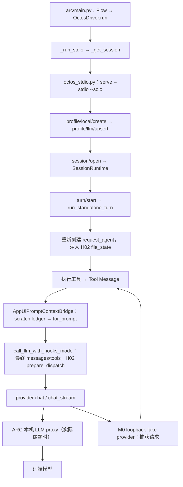

# H03 M0：共同底座、输出边界与离线反例

- 状态：M0 已完成，共同底座、边界记录和离线反例已冻结。
- 开工日期：2026-09-20；续跑证据采集日期：2026-09-21（本机时区）。
- 代码分支：`feat/output-recovery`。
- `MAIN_SHA`：`27d057c206c0f8250b60309905737f7e26ee0ba9`，本次执行 `git fetch origin main` 后固定。
- `A_SHA`：`9d65681c3ef0c2b699e2fc68bbaac1d8b0d71cf1`，最新主线加 H02 B 依赖；**不是旧 H02 实验的 A**。
- M0 测试提交：`b69c0a1e323a87dd45075ffba428e4d433079bba`。
- 本阶段没有启用 H03，也没有运行付费模型或官方做题实验。

## 1. 底座与依赖

开工时两个工作树均干净。代码仓库原位于
`feat/safe-file-cache-retained-receipts@7eaa136e`，分析仓库已位于
`feat/output-recovery`（领先其 `origin/main` 三个文档提交）。代码新分支直接从
本次 fetch 的 `origin/main` 创建，保留两个 H02 原分支。

最新主线不含 H02。用 `git cherry-pick -x` 逐个移植下面七个提交，无冲突；
`git range-diff 6aacc9fb..73f5b1bf origin/main..9d65681c` 只有来源 SHA 注记差异，
没有补丁内容差异。H02 M0 是后续补丁所修改的测试前置，因此一起保留。

| 依赖内容 | 原提交 | 移植后 |
| --- | --- | --- |
| 读取状态基线测试 | `0e236311` | `0de7d70f` |
| 强文件版本 | `463f9dbd` | `8c9b095c` |
| 模型实际收到正文后确认读取 | `9f763cf7` | `22fab975` |
| 生命周期和分支隔离 | `14a60ded` | `c507c215` |
| 过期写入与并发修改保护 | `1dc0f7e5` | `a7177b97` |
| stdio、MCP、spawn、pipeline 接线 | `7486c356` | `43cd38b3` |
| 观测与 dedup 关闭开关 | `73f5b1bf` | `9d65681c` |

依赖差异只涉及 `octos-agent`、`octos-cli`、`octos-pipeline` 的 40 个文件。
这三个 crate 的已提交内容与 H02 B 完全相同。没有移植 H02 C 的选择性保留，
也没有移植其分支与新主线间的打包、归档、官方输入或历史主线差异。
当前主线的打包改动完整保留。

共同配置固定如下；A/B 后续均继承，只有 H03 总开关及必要工具定义不同。

| 配置 | 冻结选择 |
| --- | --- |
| H01 证据胶囊 / 新摘要模型 | 此底座没有移植 H01 实验分支；保持主线实现；不传 `--llm-compaction` |
| 主线 OUP semantic context | `OCTOS_OUP_SEMANTIC_CONTEXT_MODE=on`，与当前默认相同 |
| H02 去重 | `OCTOS_FILE_READ_DEDUP=1`；现有默认也是开启 |
| H02 retained receipts | 不含 C 实现；实验环境显式设 `OCTOS_FILE_READ_RETAINED_RECEIPTS=0` |
| 文件写保护 | 保留 H02 mutation guard；不受去重/H03 开关控制 |
| 原 read window | 主对照 `OCTOS_READ_WINDOW=0`；M0 反例另测 `1` |
| H03 | M0 不存在功能实现；测试环境 `OCTOS_OUTPUT_RECOVERY=0` 不改变 A |
| session scope | `OCTOS_SESSION_SCOPE=turn`（Python 默认）；node/run 只按既有调用方选择 |
| 沙箱 | 离线 stdio 明确 `OCTOS_DANGER_FULL_ACCESS=0`；没有放开权限来使测试通过 |
| 预算与计量 | 保留外层请求数、修复数、模型输出和超时规则；假模型 usage 为合成占位值，不算真实 token |

M1 起才实现总开关：在运行时配置组装处解析一次 `1/true/on`，默认关闭，
未知值关闭并留下诊断；把同一个已解析 policy 注入实际工具和 prompt 构建方。
H03 打开时其文件页预算独立生效，不要求另开 read-window，也不能修改全局环境变量。

## 2. 实际调用图与工具名单



关键定位（源码相对 `octos-arc/`，以 `A_SHA` 为准）：

- `arc/main.py:812–875, 930–980`：driver、scope、创建会话及每轮关闭。
- `arc/octos_stdio.py:32–42, 182–235`：进程、open/start、事件及审批响应。
- `runtime/session.rs:333–365`（均在 `crates/octos-cli/src/` 下）：工作区重绑及再次应用显式 allowlist。
- `api/ui_protocol_transport.rs:34616–34756`：真正的每轮 Agent、H02 state 与 prompt bridge。
- `api/ui_protocol_transport.rs:4351–4585`：scratch 同步、压缩、最终消息替换、持久化。
- `crates/octos-agent/src/agent/llm_call.rs:71–260`：最终确认边界和 provider 请求。

**12 工具常量不等于最终请求的工具名单。** `runtime/profile.rs:61–77,1580–1593`
先做 lean 白名单；随后 `ToolRegistry::rebind_cwd_with_permissions`
（`tools/registry.rs:1479–1530`）重新注册命令别名，OUP 又注册 `SpawnTool`。
本次三种真实 stdio 场景均捕获到：

```text
ask_user_question, bash, check, diff_edit, edit_file, exec_command,
glob, grep, list_dir, read_file, shell, spawn, tool_search, update_plan, write_file
```

用实际 `arc/llm_proxy.py::trim_request` 处理同一捕获请求后，默认工具表为：

```text
bash, diff_edit, edit_file, glob, grep, list_dir, read_file, shell, write_file
```

两者都没有 `recall`。代理还可通过 `extra_drop_tools`、`no_tools`、请求预算耗尽
继续收窄；`OCTOS_STDIO_SOLO_TOOLS` 也是限制，不能靠添加一处注册绕过这些政策。
本脚本直接连接本地 fake provider，代理裁剪是对捕获字节运行真实纯函数验证，
没有声称跑过完整 `Flow` 或代理 HTTP 服务。

## 3. 文件、命令到模型的逐层损失

| 顺序 | A 的实际行为 | 证据位置 |
| --- | --- | --- |
| 文件，无 window | 先拒绝超过执行预算的无范围大文件；显式范围读取稳定版本，格式化后最多保留 100,000 字节前部 | `tools/read_file.rs:726–765,831–935` |
| 文件，有 window | 同一稳定版本；正文最多 2,000 行/49,152 字节，另有 400 字节 footer 余量；超长行提示 byte mode | `tools/read_window.rs:124–139`，`read_file.rs:626–700,831–915` |
| 执行层 | read_file 50,000；shell 30,000；默认工具 50,000 字节，70% 首部/30% 尾部；随后追加工具恢复建议 | `octos-core/src/utils.rs::tool_output_limit`；`agent/execution.rs:2427–2437` |
| sanitize/hook | after-tool hook 先运行但正文随后裁剪、sanitize，最后附 sanitized hook feedback；附加文字不统一计入总预算 | `agent/execution.rs:2378–2444` |
| 结果合并 | 并行/串行按原调用顺序合并；no-progress 等后处理还可能追加文字 | `agent/loop_runner.rs:3299–3380` |
| ContextManager | 记录收到的字符串为 raw；前 8,192 字节加 `\n[truncated]`，实际可见 8,204 字节；UI preview 另为 512 字节 | `api/context_manager.rs:2422–2480,3821–3845` |
| prompt pressure | 超限时再按约 `max_tokens*4/2` 限制每条工具消息，并删除可移除组；未统一分配整批空间 | `context_manager.rs:3663–3689`、`for_prompt` |
| 最终 provider | 发送当前向量；H02 对参数、输出 hash、出现次序和策略核验，成功主模型响应后才确认读取 | `agent/llm_call.rs::call_llm_with_hooks_mode` |

默认文件上限是 10,000,000 源字节，不是 10 MiB；M0 未改变。
行号与 footer 是展示字节，不属于源内容。CRLF、BOM、空文件、UTF-8 字节页的
新版精确语义留给 M1 固定，本阶段未假装已有无损的最终分页。

`truncation_recovery` 在有 offset/limit 时直接建议 `offset+limit`
（`read_file.rs:410–436`）。窗口自身的 `included_end+1` 不能挽救更下游再次裁剪。
因此必须根据**最终页**计算 next。

## 4. 元数据、审批、重试和回放

`ToolResult.structured_metadata` 当前实际路径为：

```text
ToolResult → execution 的独立 tuple → execute_tools 元数据数组
  → loop_runner（do_not_retry_same_turn 等消费）
  → ConversationResponse.tool_results → 宿主成本/结果事件
```

它不随 `Message` 到 `ContextManager::record_message`，不进入现有
`ToolOutputEnvelope`，也不作为 provider 消息字段发送。
`h03_m0_metadata_goes_to_response_not_provider_messages` 在真实 Agent/fake provider
上验证：response 保留 metadata，最终 messages 只有正文。

| 路径 | 是否经过普通执行后处理 | 必须保留的边界 |
| --- | --- | --- |
| 普通调用、串行、并行 | 都经 `spawn_tool_task`，再按调用顺序合并 | 调用 occurrence 在执行侧绑定，不能只用重复 call ID |
| stdio 工具内部审批后返回 | 原工具 future 等待批准，之后仍进普通后处理 | 不能重复保存或执行 |
| gateway 人工规则暂停后继续 | **不同**：`execute_approved_tool` 返回 ToolResult；仅有 hook feedback 时裁剪并追加反馈；宿主转成审批结果和 continuation | `execution.rs:469–588`，`session_actor.rs:5749–5810`；M1/M5 显式接入 |
| provider 内部重试 | 同一份准备过的 messages 重试，不重新执行工具 | 不凭一次失败激活 H02，也不重复产生结果身份 |
| context retry | 循环再次以 `PromptContextPhase::Retry` 进入 bridge | 重新渲染、同步范围和证明 |
| 历史/冷启动/事件回放 | 从 Message/snapshot 重建；不是重新执行 ToolResult | 有 typed 持久索引才可恢复来源；旧文本不能授予能力 |

**失败 bridge 不是事务。** `agent/compaction.rs:241–288` 捕获错误后继续使用传入
的当前可变向量，没有恢复备份。返回错误前若修改了消息，发送的就是部分修改后的
向量；若没有修改，发送原向量。`h03_m0_bridge_error_uses_current_vector_without_rollback`
在两种情况下都捕获了最终 provider 请求。现有 AppUI bridge 的正常持久化错误只写
warn，主要可返回错误点在 scratch 未初始化处；不能把“当前不常出错”当成 H03 合同。

### 选定的数据通道（M1 起实现）

采用已有 H02 的**任务/分支有界共享状态 + 最终发送确认**方向，不向正文塞 JSON 再解析。
H02 的 `ToolContext.file_state_cache/model_read_receipts/task_file_state`、
`read_file` 的候选登记、`prepare_dispatch` 已有可运行验证；本次 H02 集成和两轮 OUP
测试再次证明真实 request_agent 收到了它们。

1. 在 `octos-agent` 定义小型 typed 来源/视图和输出服务 trait，沿用 `ToolOutputLedger`
   的依赖方向。上层实现/注入存储，agent 不依赖 CLI。
2. `ToolContext` 持有任务服务与执行侧生成的不可变 occurrence/output ID。
   `ToolResult` 增加可选 typed view；普通执行及批准后执行把它登记进同一个有界状态。
   原 `structured_metadata` 的成本等用途保持。
3. Agent、SessionRuntime、AppUI bridge、SessionActor 共享同 owner 的服务；从运行时
   call occurrence、规范参数和最终 view digest 关联 Message 与来源，不以正文 ID 授权。
   bridge 在录入/投影时把 typed 来源写进 envelope，持久索引保存独立身份。
4. 清洗、hook 或 pressure 改变正文时更新 view/proof，不能证明时撤销 H02 候选。
   最终发送边界覆盖 bridge 成功、失败及 legacy/MCP；旧工具无 metadata 保持旧行为。
5. 冷恢复从版本化 manifest 重建 owner/来源；不能只靠内存 `Arc` 身份。
   历史 recall 不登记当前文件读取凭据。

这是一份冻结的接口选择，不表示 M0 已实现新字段。真正的 typed H03 到消费方测试是
M1 完成条件；目前自动验证的是旧 metadata 的断点、可复用 H02 通道以及真实发送位置。

## 5. recall、命令采集与入口范围

`RecallTool` 只在生产 `session_actor.rs:3535–3540` 注册，
`SessionToolOutputLedger` 在持有 ContextManager mutex 时整份 clone 字符串。
`fetch(call_id)` 先查内存 `recall_index`，再找 artifact map；同 call ID 最新写入覆盖。
`from_snapshot` 重建时两个 map 均为空。磁盘 artifact 已存在仍可返回找不到。
旧 page 按约 49,488 字节正文分段，超大 page 钳到最后一页；恢复结果再次落盘和 8 KiB
裁剪均可能发生。授权目前依赖所注入的 session 对象，没有新版 output owner/cursor 校验。

`shell.rs:1177–1359` 用独立 waiter task 执行 `wait_with_output`，stdout/stderr
完整缓冲后 lossy 解码、stdout 在前/stderr 在后组合，先截到约 50,000 字节再附退出码；
执行层又截到 30,000。`success` 来自真实 status，信号退出的 code 映射为 -1。
超时发送 TERM/KILL 并仅返回超时文字，已采集正文不返回。取消 caller 会 detach waiter，
usage claim 等子进程退出才释放，不等于已取消子进程或可读日志。
后台 `execute_background` 使用 `Stdio::null()`，未捕获的内容无法恢复。

实际工具表还含 `bash` 与 `exec_command`；它们在
`tools/coding_tools.rs` 有自己的 `wait_with_output` 路径
（约 538、2112 行），不是 `ShellTool` 的同一实例。
`exec_command` 的 tty/yield 路径另用有限尾部 capture，早期内容会被丢弃。
不能把 shell 的一次测试当成这几个路径都已支持。

| 入口 | 本轮 B 的范围 |
| --- | --- |
| ARC stdio/solo | 完整文件页、前台 shell/bash/exec_command 的同次输出恢复及搜索；所有最终 schema/限制实测 |
| SessionActor | 共用恢复语义，批准后继续单独接线；不保留另一套超大页 |
| MCP `run_session` | 公共执行改动使其受影响，**选择同 invocation 内恢复和搜索**；每调用独立 owner/服务 |
| MCP 跨 invocation 冷恢复 | 不宣称支持；不为 MCP 实例化 AppUI |
| spawn/pipeline | 公共构造与独立 child 权限回归；不自动共享父级输出或正文可见凭据 |
| 后台 shell、exec tty/yield | 保留既有任务系统；只对确实捕获且仍保存的范围作声明，否则 explicit partial/unavailable；不承诺历史全文 |

MCP 当前构造在 `commands/mcp_serve.rs:564–629`，其文件状态已随 H02 移植，
但没有 ContextManager bridge/recall。入口支持是后续工作，M0 不宣称已经接通。

## 6. 冻结的有限预算

下面是 **B 首版 policy 的选值**，M0 不改变运行常数。M1/M2 必须从一个解析后对象共享，
不能在文件工具、CLI 和恢复工具各复制一份。

| 项目 | 固定值 / 规则 | 依据 |
| --- | --- | --- |
| 单结果展示 | **8,192 UTF-8 字节总量**，包括正文、行号、状态、范围、next、hook、引用 | 与现 stdio 限制同量级，不引入更大页变量 |
| 文件行上限 | 2,000 行；字节预算通常先触发 | 复用 read-window |
| 元数据余量 | 先渲染完整状态头并扣实际长度；最小可用总预算 512 字节 | 使用短 output ID；装不下完整头/一个码点则先压缩或明确预算错误 |
| 批量分配 | min(工具限制, 8,192, 当前分配额度)；按调用顺序均分剩余额度，余数依序分配 | 多工具共享一份余量；不单独挤占全部空间 |
| 文件源上限 | 保留 10,000,000 字节读取限制 | 既有 provider 边界 |
| 单输出存储 | 16 MiB 总量；命令每 stream 最多 8 MiB | 可容纳最大既有文件，日志约数百页但有限 |
| 每 session | 64 MiB payload，256 条 output index，4 MiB 元数据总量；单 manifest 16 KiB | 容纳数个大结果；任一先到均不得继续增长 |
| 数据目录总量 | 256 MiB（含 metadata、临时写入、已发布正文） | 防止多个 session 绕过总配额；发布前预留 |
| 采集内存 | 每 stream 64 KiB；每 session 最多 8 个同时保存的输出 | 排空不随日志增长；超限捕获继续排空并显式 partial |
| 页读取 | 64 KiB 扫描块，按请求范围 seek/读；不整份 fetch，不在全局 context 锁内磁盘 I/O | 限制大日志恢复内存与锁占用 |
| 运行中保存 | 活跃写入/pinned 引用不清理；已结束且未引用对象 24h 过期 | 支持当日断线恢复，同时不永久累积 |
| 清理 | session 结束、启动及配额压力时清理非活跃过期/LRU 对象；活跃数据占满则 storage_limit | 不删仍在写的对象，也不无限保留 |
| 搜索（M7） | 单次扫描 1 MiB，最多 64 匹配，每段 256 字节且总响应仍 ≤8,192 | 输出位置和 next；未扫完必须 search_complete=false |

超容量保存已发布前缀并标 partial/已知或未知缺口，不能停止读 pipe 造成死锁。
保存失败不重跑命令。首尾预览的尾部如未保存应明确不可恢复。
跨块清洗必须沿用完整文本规则；仅加一个固定 overlap 不能证明任意长 token 被完整清洗。
M2 需验证状态化处理及源字节/安全视图的区别；无法准确映射不能授予文件全文覆盖。
TTL 和 global cap 都受活跃对象规则约束，不能通过旧引用无限 pin 新对象绕过配额。

## 7. 可重放反例与证据

代码新增内容仅为测试：

- `arc/integration/output_recovery_baseline.py`：真实子进程 stdio/solo + 本机 HTTP fake provider，
  捕获完整 messages/tools，三种夹具共 7 个模型请求。
- `crates/octos-cli/src/api/context_manager.rs`：3 个 `h03_m0_*` 基线测试。
- `crates/octos-agent/tests/h03_m0_dispatch.rs`：2 个 metadata/fallback 基线测试。

这些是断言当前缺口的**绿色基线测试**，不是把目标行为的红测试塞进 CI。
后续功能实现时应改为 H03 off 兼容覆盖或替换成新合同，不能让 B 继续满足丢内容断言。

| 反例 | 实测结果 |
| --- | --- |
| window 文件页 | 源 171,230 字节；保存 49,242；最终首个工具结果 8,204；第 200 行标记和 footer 在保存结果内、在模型请求中消失 |
| 显式 1–1,000 行 | 先 100KB、再 50KB；artifact 50,127 字节，建议 offset=1001；第 500 行标记已丢；实际下一次读到 1001，缺口仍没补 |
| 大 stdout + 唯一 stderr 错误 | 命令真实 exit=7，计数文件证明执行一次；artifact 29,983 字节已无 stderr 标记；最终 8,204 字节也无退出码 |
| 不可达 recall | 3 个真实请求的 schema 与默认代理裁剪结果均无 recall |
| 冷恢复 | artifact 内容逐字相同，snapshot 仍有引用，但 from_snapshot 和 load_snapshot 后 fetch 均 None |
| 重复 call ID | prompt 可保留两次结果，但 fetch 只返回较新结果 |
| 再恢复再截断 | recall 第一页有中间标记和 page footer，ContextManager 再切后两者都消失，并产生第二份 artifact |
| metadata / bridge 失败 | metadata 只进 response；失败前修改过的向量直接到 provider，无自动 rollback |

本次 stdio 反例运行时的二进制 SHA-256：
`035c0ee3dad076954553765dbb8221dac364e18269b2869c10fcb2c84df81937`。
源码为 `A_SHA` 加上述测试；没有运行时代码差异。
后续 `cargo test` 会因 dev-dependency features 重新构建 `target/debug/octos`，
该路径不是不可变产物；这里的哈希绑定捕获记录，不承诺后续构建仍为同一文件。
M8 必须从冻结 SHA 重新构建、隔离保存并核对实际二进制。
标准 fixture SHA-256：
`70fca19ddd5bd6ffb578753f218a3ff4ef1c15e416e9108705f157cd60e1835f`。

重放（在代码仓库根目录；证据目录必须为新的空目录）：

```bash
source ~/.zshrc
export PATH="$HOME/.rustup/toolchains/1.96.1-aarch64-apple-darwin/bin:$PATH"
cargo build --locked -p octos-cli --bin octos
python3 arc/integration/output_recovery_baseline.py target/debug/octos ../octos-arc-analysis/test-temp/h03/replay
cargo test -p octos-agent --test h03_m0_dispatch
cargo test -p octos-cli --lib h03_m0
```

脚本保持严格沙箱。运行目录使用 `target/h03-*` 短路径避免 macOS `SUN_LEN`；
长目录首跑的错误在 baseline 日志中保留。实际 artifact 位于
`workspace/.octos/<profile>/context_ledgers/tool-output/`，文件名经过 `safe_filename`
编码/缩短，不能假设位于 `--data-dir` 或仍以 `.txt` 结尾。
第一次 artifact 查找使用错误位置导致夹具失败，已按真实存储位置修正后通过。

现有 `octos_stdio.py` 审批响应仍缺 `session_id`。脚本用测试专用子类补该字段，
未改生产文件；三场景的审批事件数实际均为 0，**不把它们算作审批路径验证**。
真实做题若触发审批，此外层缺口仍需先解决。

## 8. 验证与提交

环境：macOS aarch64；Rust/Cargo 1.96.1；Python 3.9.6；Node v26.0.0。
每次运行前执行了 `source ~/.zshrc`，随后显式加入 Rust toolchain 路径。
agent/CLI 库先执行 `-- --list`，分别列出 2,952 / 3,702 项；
新增 dispatch 测试单独 list 确认 2 项。没有把零命中过滤当成成功。

完整命令、数量、退出码及原始日志见
[checks.json](./m0-evidence/checks.json)。各聚焦套件加最终串行 shell 和新 dispatch
合计 **601 passed、2 ignored**（不重复累计单独复跑的三个 M0 unit）。
不是整个 workspace 的全量测试结论。

| 验证 | 结果 |
| --- | --- |
| file_state_cache / model_read_receipts / task_file_state | 15 / 21 / 3 passed |
| read_file / read_window | 55 / 16 passed |
| write_file / edit_file / diff_edit / apply_patch / mutation_guard / nofollow | 48 / 37 / 11 / 49 / 2 / 19 passed |
| recall / spawn | 3 passed；94 passed、1 ignored |
| compaction / loop_compaction / llm_call | 2 / 6 / 11 passed |
| H02 M1–M3 + 三个 M8 集成套件 | 27 passed |
| ContextManager（含三个 M0 基线） | 99 passed |
| AppUI bridge / H02 OUP 接线 / SessionActor bridge | 1 / 2 / 3 passed |
| MCP integration / pipeline m8_parity | 14 / 6 passed |
| 新增 h03_m0_dispatch | 2 passed |
| shell 最终串行执行 | 55 passed、1 ignored，见 [shell-serial.log](./m0-evidence/shell-serial.log) |
| 真实 stdio fake provider | 3 场景通过、7 请求，见 [stdio-summary.json](./m0-evidence/stdio-summary.json) |
| `cargo check --workspace --tests` | 退出码 0 |
| `cargo fmt --all -- --check` | 退出码 0 |

shell 首次默认并行运行是 45 passed、10 failed、1 ignored，退出码 101，
有 120s 超时与子进程等待失败；后改为同一套件 `-- --test-threads=1` 全部通过，
没有改源码、断言、沙箱或命令超时。失败原始记录保留在
[check-12.log](./m0-evidence/check-12.log)；并行失败原因没有继续做专项根因定位，
不能把首次运行说成通过。M0 采用串行结果验证未修改的 shell 底座。

严格 Clippy 命令为：
`cargo clippy -p octos-agent -p octos-cli --all-targets -- -D warnings`。
退出码 101，唯一诊断仍是未修改的 `crates/octos-cli/src/commands/serve.rs:878`
`clippy::nonminimal_bool`。只对这项既有告警加
`-A clippy::nonminimal-bool` 后全部 target 检查通过，退出码 0，见
[clippy-baseline-exception.log](./m0-evidence/clippy-baseline-exception.log)；
没有更改源文件或项目规则。

`cd arc` 后执行 `python3 -m unittest discover -s tests`：408 项，
399 passed、8 skipped、1 error，退出码 1。错误为
`RuntimeCacheProvenanceTests.test_should_replace_a_stale_archive_before_recording_its_new_source`，
Python 3.9.6 不支持 `tarfile.extract(..., filter="data")`；
见 [check-27.log](./m0-evidence/check-27.log)。未修改 Python 运行代码来绕开它。
真实实验应在支持该参数的 Python 环境准备好后再运行。

原始最终 messages/tools、事件、artifact 正文与来源哈希均已归档到
[m0-evidence](./m0-evidence/)，只含本地合成夹具。
artifact 以 JSON 的 `utf8_text` 字段无损保存，解码后校验原字节 hash；
测试日志仅清理行尾空白和多余末尾空行，以通过 `git diff --check`。
SHA、额外命令、通过数量和限制的机器可读记录见
[manifest.json](./m0-evidence/manifest.json)。

代码仓库本地提交 `b69c0a1e`，该提交只含上述三个测试文件；
`git diff --check` 与预期路径检查通过，代码工作树干净。
本分析记录、清单及证据在分析仓库单独本地提交；未推送、未创建远程 PR。

M1 的起点固定为本次 A 和 M0 测试提交：先实现 shared policy、typed 来源/范围和
预算内渲染，覆盖真正发送、fallback、批准后执行与命令别名；再进入持久存储。
M1–M9 均未完成，不能把本次基线复现当作恢复功能或性能收益。
