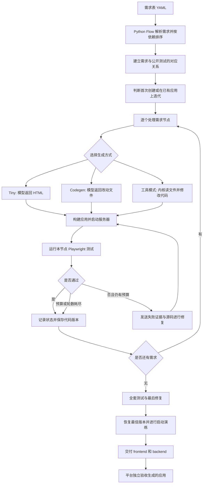

**Octos ARC 仓库导读：从需求表到可运行应用，再到测试成绩**

分析日期：2026-09-15。分析对象：[woshuoduijiushidui/octos-arc](https://github.com/woshuoduijiushidui/octos-arc)，当前提交 `c599d18c`。本文以当前源码为准；历史实验成绩明确单独说明。这次没有修改做题代码，没有调用收费模型，没有创建平台提交。

**1. 先理解我们以后要优化的对象**

这个仓库提供一套“让模型按需求写应用，再用自动化测试检查并修复”的程序。它继承了 Octos 通用 AI Agent 内核，并增加 ARC-Bench 做题适配层。我们要改的是这套生成与修复程序；每道题生成的计数器、订票网站等，是它的产物。

外层程序决定先做哪个需求、给模型什么信息、何时测试、失败后如何修复、保留哪个代码版本。模型负责理解输入并生成代码。浏览器测试负责检查生成的应用能否完成指定操作。模型的回复“已经完成”，本身不能证明通过了测试。

你提出的目标有明确先后关系：优先让更多真实测试通过；成绩相同或接近时，再减少 token。不能靠少实现需求、放宽测试、忽略失败或把启动成功记成验收成功来提高成绩。

**2. 仓库地图**

| 路径 | 小白可以怎样理解 | 与优化的关系 |
|---|---|---|
| `arc/` | 做题调度员、测试员、成绩记录员 | 第一优先，默认链路大部分在这里 |
| `crates/octos-cli/` | Octos 可执行程序的入口与组装 | Python 通过它启动内核 |
| `crates/octos-agent/` | 模型执行循环、文件工具、shell、上下文处理 | 工具模式和长上下文成本的核心 |
| `crates/octos-llm/` | 请求模型的接口、响应与用量解析 | 模型调用、token、缓存和费用 |
| `crates/octos-arc/` | Rust 版 ARC 编排器，以及保留的旧原生入口 | 可选引擎，不能和默认 Python 混为一条链 |
| `crates/octos-core/` | 协议与共享数据类型 | Python 和内核交换消息的基础 |
| `crates/octos-bus/` | 会话、消息、事件基础设施 | 会话运行和记录 |
| `crates/octos-memory/` | 长期记忆与检索 | 通用能力，是否进入 ARC 请求要看配置 |
| `crates/octos-pipeline/`、`octos-swarm/`、`octos-workflows/` | 工作流及多个 Agent 的协作能力 | 仓库有这些能力，不代表默认逐节点 ARC 流程就在使用 |
| `dashboard/`、`crates/octos-web/`、`swarm-app/` 等 | 通用界面与客户端 | 不应作为首次通过率优化的主战场 |
| `e2e/` | Octos 产品本身的端到端测试 | 与 ARC 对生成应用的验收不同 |
| `arc/public-tests/` | 各道题公开的 Playwright 测试 | 检查生成应用，也作为模型输入 |
| `arc/tasks/` | 离线需求表 | 做题输入 |
| `arc/tests/` | 测试编排器自己的逻辑 | 防止优化时把调度、修复、记录逻辑改坏 |
| `evidence/`、`docs/`、`arc/CHANGELOG.md` | 历史实验记录和平台返回快照 | 判断过去的改动有没有成绩证据 |

Rust 的 crate 可以类比 Python 的一个包。Cargo workspace 表示这些包放在同一个仓库里一起管理；不代表每次执行都要使用全部包。

**3. 需求表是什么**

输入通常是 YAML。YAML 是一种方便人读写的结构化文本，可以类比一份写成文本的 Python 字典和列表。这里的需求是一棵树：`FOLDER` 是组织需求的文件夹，`ATOMIC` 是具体要实现的任务。

常见字段：`id` 是唯一标识；`name` 是名字；`description` 是详细要求；`dependencies` 是前置需求；`scenarios` 是使用场景；`children` 是子需求。场景里的 GIVEN / WHEN / THEN 表示“在什么条件下，做什么操作，应该发生什么”。

计数器题的实际要求是：初始为 0，有名为 Increment 和 Decrement 的按钮，显示数字的元素具有 `data-testid="count"`。点两次加号应显示 2，再点三次减号应显示 -1。迭代题增加 REQ-2：Reset 按钮把数字归零，且依赖原来的 REQ-1。

重要的是，需求节点、场景、测试文件、测试用例和断言数量不是同一个数字。一条订票需求可以有多个场景和多个测试。

当前离线目录的静态统计如下。这里“用例”指 `test(...)` 声明数；不是本次运行的通过数，也不是平台全部可能的验收内容。

| 题目 | ATOMIC 节点 | spec 文件 | 公开测试用例 |
|---|---:|---:|---:|
| smoke--counter | 1 | 1 | 1 |
| smoke--dice | 1 | 1 | 1 |
| smoke-evolution--counter | 2 | 2 | 2 |
| smoke-evolution--dice | 2 | 2 | 2 |
| ticket-booking--ticket-booking | 2 | 2 | 10 |
| arc-bench-web--keep | 32 | 32 | 32 |
| arc-bench-web--bookstack | 34 | 34 | 34 |
| arc-bench-web--stackoverflow | 66 | 66 | 66 |
| arc-bench-web--prestashop | 86 | 86 | 86 |
| arc-bench-web--12306 | 117 | 117 | 135 |
| arc-bench-web--ctrip | 125 | 125 | 125 |
| 合计 | 468 | 468 | 494 |

**4. 当前默认总链路**



入口是 [main.py:2674](https://github.com/woshuoduijiushidui/octos-arc/blob/c599d18c5acd2b846f049ffea2be84e72fe60fac/arc/main.py#L2674)，总控是 [Flow.run:2404](https://github.com/woshuoduijiushidui/octos-arc/blob/c599d18c5acd2b846f049ffea2be84e72fe60fac/arc/main.py#L2404)。默认是 Python 编排；只有配置 `OCTOS_ARC_ENGINE=rust` 才进入另一套 Rust harness。

**5. 前期准备：排顺序、找测试、判断是否迭代**

[requirement_order.py:49](https://github.com/woshuoduijiushidui/octos-arc/blob/c599d18c5acd2b846f049ffea2be84e72fe60fac/arc/requirement_order.py#L49) 把原子需求按 dependencies 排序，叫“拓扑排序”：注册必须在登录之前，就先实现注册。Python 当前遇到未知依赖会忽略，遇到环会按文档顺序打破；Rust 原生需求解析有更严格的校验，两个引擎不能视为完全相同。

[acceptance.py:43](https://github.com/woshuoduijiushidui/octos-arc/blob/c599d18c5acd2b846f049ffea2be84e72fe60fac/arc/acceptance.py#L43) 根据 `REQ-*.spec.ts` 文件名建立测试与节点的对应关系，还处理 spec ID 比需求 ID 更细的情况。订票题的节点是 REQ-1 / REQ-2，spec 标识可能细分，因此要映射和镜像状态。

首次创建叫 create；在旧应用上增加或修改功能叫 evolution。这里的 evolution 主要是软件迭代，不是模型训练。编排器读取上一版 `.arc/traceability/requirements.json`，用 name、description、scenarios、dependencies 的指纹比较内容。指纹就是把内容计算成一个短标记，以判断它有没有改变。

没有上一版需求记录时，已有应用也会先跑测试：已通过的需求可以免去模型生成。若旧模板经过探测但没有一个节点通过，代码会把模板移到 `.arc/template-discarded/`，按新建路径做题。只看到两个 package.json 并不证明旧应用真的实现了需求。

**6. 实现一个需求节点：三种生成方式**

完整节点流程在 [main.py:1994](https://github.com/woshuoduijiushidui/octos-arc/blob/c599d18c5acd2b846f049ffea2be84e72fe60fac/arc/main.py#L1994)。默认经常不会单独跑骨架轮；Python 自己写基础 manifests，模型从第一个功能开始生成。

Tiny 在 [main.py:1486](https://github.com/woshuoduijiushidui/octos-arc/blob/c599d18c5acd2b846f049ffea2be84e72fe60fac/arc/main.py#L1486)。节点测试和 helpers 小于默认 1500 字符时尝试。Python 提供固定的静态服务器、构建脚本和包配置，模型只输出 HTML。这样计数器不用让模型反复读写一套工程。立即测试；失败再进入更完整的 codegen。Tiny 是按文本大小选择，不足以保证需求本身简单；例如后端存储或跨用户状态是否适合这个档位，需要结合实际需求检查。

常规 codegen 在 [main.py:2046](https://github.com/woshuoduijiushidui/octos-arc/blob/c599d18c5acd2b846f049ffea2be84e72fe60fac/arc/main.py#L2046)。模型收到需求说明、公开测试和已有相关源码，返回完整改动文件：

```text
<<<FILE frontend/index.html>>>
完整文件内容
<<<END FILE>>>
<<<FILE backend/server.js>>>
完整文件内容
<<<END FILE>>>
```

[codegen.py:30](https://github.com/woshuoduijiushidui/octos-arc/blob/c599d18c5acd2b846f049ffea2be84e72fe60fac/arc/codegen.py#L30) 解析文件块，[codegen.py:118](https://github.com/woshuoduijiushidui/octos-arc/blob/c599d18c5acd2b846f049ffea2be84e72fe60fac/arc/codegen.py#L118) 写文件。它还补 HTML 字符集，对某些 JS 转义造成的语法错误做有限检查和修复。当前去重导航的兼容函数是空操作，不会自动删导航。

默认 codegen 也用于大题，最大节点参数默认 999。每个节点检查上下文是否能装入默认 90,000 字符预算。字符数不等于 token 数，不同语言、代码和模型之间的转换比例不同。

工具模式由 Octos 内核执行：模型说“读文件”，工具返回文件；模型说“修改文件”，工具写入；模型继续判断下一步。上下文放不下、修复证据不完整或 codegen 反复失败时，会转到这一模式。它适合精确调查和局部改动，但每次往返都可能重新发送已有历史，因此要关注请求次数。

设计可以单独进行，也可以折叠到实现轮。当前默认是 inline，至少 3 节点才启用设计逻辑。源码会记录 design_done，但默认 compact 首轮没有真正携带已组装的 design_text；这个状态不能证明模型已经看到或遵守了完整设计契约。

**7. Python 怎么控制 Rust，Rust 怎么控制模型**

```text
Flow / OctosDriver
  → octos_stdio.py
  → 启动 octos serve --stdio --solo
  → 创建编码 profile，配置模型，打开 session
  → turn/start
  → Rust Agent 请求模型
  → 模型直接输出代码，或请求文件/shell工具
  → 工具结果回到模型（工具模式继续循环）
  → turn/completed 或 turn/error
  → Python 收集结果并测试
```

stdio 可以理解为两个程序通过输入和输出交换一行行 JSON 消息。OUP 是 Octos 定义的控制协议，类似约定好的命令格式。`session` 是一段对话历史，`turn` 是一次交给模型执行的任务轮。一次 turn 可能包含很多次模型请求，尤其是工具模式。

默认 session scope 是 turn，即每轮重新开会话，避免把整个做题历史不断传下去。代价是新一轮必须重新收到足够的需求、源码和失败证据。node 会在同节点内共用历史，run 会全题共用。哪个更省不能靠名称判断，需要统计完整输入、输出及缓存用量。

默认 solo 编码 profile 提供 12 个编码工具，代理可能再裁掉其中一部分。通用仓库具备记忆、目标管理和多 Agent 协作，并不意味着默认 ARC 每轮都把这些能力注入模型。

实际 stdio 上下文由 CLI 的 AppUiPromptContextBridge / ContextManager 管理。默认估算用量超过模型窗口的 70% 时触发，目标压到触发阈值的 2/3；保留最新用户任务和完整工具交互。默认使用启发式摘要，启动命令没有打开 `--llm-compaction`。模型可见的大工具结果最多约 8 KiB，更大的原始结果可以另存并保留引用。不能看到 agent 中有 compaction_tiered.rs 就认定它是这条 stdio 路径实际使用的压缩器。

这类压缩主要影响工具模式内部较长的一轮读写；默认每轮重开会话，不是在全题末尾把所有需求历史统一压缩。关键源码为 [ContextManager](https://github.com/woshuoduijiushidui/octos-arc/blob/c599d18c5acd2b846f049ffea2be84e72fe60fac/crates/octos-cli/src/api/context_manager.rs#L2689)、[stdio bridge 挂载](https://github.com/woshuoduijiushidui/octos-arc/blob/c599d18c5acd2b846f049ffea2be84e72fe60fac/crates/octos-cli/src/api/ui_protocol_transport.rs#L34720) 和 [Agent 主循环](https://github.com/woshuoduijiushidui/octos-arc/blob/c599d18c5acd2b846f049ffea2be84e72fe60fac/crates/octos-agent/src/agent/loop_runner.rs#L909)。

**8. LLM 代理做什么，为什么与 token 有关**

[llm_proxy.py](https://github.com/woshuoduijiushidui/octos-arc/blob/c599d18c5acd2b846f049ffea2be84e72fe60fac/arc/llm_proxy.py) 是请求模型之前的一层本机转发器。它会按设置裁掉 ARC 无关的系统提示词和工具、调整推理设置、限制一轮请求数、提高过小的输出上限、处理流式响应、记录用量。

默认输出上限至少设为 32768。这是允许模型生成多少的上限，实际只按真实用量统计；不是每次请求固定消费 32768。贸然降低上限会把完整文件截断，从而增加修复和重发，可能更贵。

可选模型路由按 implement / repair / verify / design 阶段、完整消息与工具定义字符数、工具/图片能力匹配规则，第一条匹配生效。它没有默认的小模型和大模型组合，也没有经过本次实验验证的成本收益。当前源码的 Python 和新版 Rust 都有路由支持；README 后半“仅 Python 支持”是过期说明。

**9. 自动验收与修复闭环**

Playwright 是自动操作真实浏览器的测试工具。它能打开网址、填表、点按钮、读取页面并检查结果。因此前端可访问名称、label 与 input 的关联、元素可见性、状态、后端响应和数据保存都会影响成绩。

例如 `page.getByTestId('count')` 找的是 `data-testid="count"`，不是普通的 `id="count"`；`getByRole('button', {name:'Increment'})` 查的是按钮的可访问名称。功能看起来存在，定位器匹配不到，测试也会失败。

一次验收大致是：安装必要依赖 → `frontend/npm run build` → 启动 backend → 等待 HTTP 就绪 → 跑当前节点的 spec → 解析原始报告 → 停服务 → 恢复测试造成的数据改动。测试会注册用户、改计数器，不能把这些测试后的脏数据当成初始状态交付。

修复循环在 [main.py:1837](https://github.com/woshuoduijiushidui/octos-arc/blob/c599d18c5acd2b846f049ffea2be84e72fe60fac/arc/main.py#L1837)。失败摘要包含 Feature（哪个行为失败）、Failed at（位置）、Observation（观察到的错误）、Steps（前面的动作），并补相关测试源码和应用源码。构建或启动失败也会进入修复输入。

代码保留通过数最多的版本，改善时保存 Git commit，退步时可以恢复；codegen 修复重复失败后转工具模式。只有尚未证明任何有效行为时才允许零通过后的完整重写，以减少重写破坏已通过功能的风险。它仍然有轮数、时间和请求预算，不能无限修复。

默认小题单节点修复上限 5，大题不显式配置时自动降到 3；节点时间默认最多 1500 秒，初始实现最多用 60%，剩余不足默认 300 秒就不再开修复。全套验收默认还有最多 2 轮修复。

**10. 为什么逐节点通过后还要跑全套测试**

新需求经常修改同一个 `backend/server.js`、首页或公共脚本。登录节点通过，不代表它没有改坏注册。这个现象叫回归：以前能工作的功能被新改动破坏。

[main.py:2235](https://github.com/woshuoduijiushidui/octos-arc/blob/c599d18c5acd2b846f049ffea2be84e72fe60fac/arc/main.py#L2235) 在处理中间的若干检查点重跑已通过的需求；[main.py:2277](https://github.com/woshuoduijiushidui/octos-arc/blob/c599d18c5acd2b846f049ffea2be84e72fe60fac/arc/main.py#L2277) 在末尾跑全套。全套测试还会暴露共享服务、多个用户、数据隔离及资源压力的问题。执行整个套件并不意味着配置下每个测试都一定并发。

最后的 rehearsal 是按交付方式构建和启动：frontend 需要 build 出 dist，backend 需要 start 并读取 PORT。它证明工程能启动，不能替代功能验收。

**11. 三层结果不能混用**

| 结果 | 能证明什么 | 不能证明什么 |
|---|---|---|
| 编排器正常退出 / run completed | 做题程序走完了流程 | 全部需求与测试通过 |
| 节点 PASSED / traceability 状态 | 编排器记录了一个节点状态 | 一定存在真实浏览器测试证据 |
| 本地 Playwright 原始报告 | 某份代码在本地条件下通过或失败 | 在另一环境、另一初始状态必然同成绩 |
| 平台官方返回与逐用例结果 | 那次平台验收的真实结果 | 当前新提交已经复现了该成绩 |

当前 [main.py:2529](https://github.com/woshuoduijiushidui/octos-arc/blob/c599d18c5acd2b846f049ffea2be84e72fe60fac/arc/main.py#L2529) 的无真实本地验收分支，可能凭 final check 和启动演练标记 test_passed；甚至 final_ok 为 None 也满足 `is not False`。正常流程即使还有失败节点通常也返回 0。后续实验不能用退出码或 PASSED 数代替真实成绩。

一个真实反例是订票运行 `4c4146be7bbf`：stdout 里逐节点 6/6、4/4，全套 10/10；但平台 run.json 返回 9 通过、1 失败，登录用户名场景超时。不能仅凭 timedOut 判断机器慢，要继续看等待的定位器、动作和页面状态。

**12. 现有成绩与其边界**

仓库保存许多历史实验，不同实验版本、配置和环境不相同。下面来自已有平台 run.json 快照；这次没有重新做题。字段名称 `token_cost_usd` 在这些记录里配套 currency=CNY，因此金额按人民币解释。

| 历史平台运行 | 结果 | 平台 token 字段 | 人民币费用 |
|---|---:|---:|---:|
| Counter，b438df2a5fcb | 1/1 | 476 | 0.002772 |
| Dice，b88799874e8a | 1/1 | 400 | 0.002382 |
| Counter Evolution，bcf72deae878 | 2/2 | 556 | 0.002808 |
| Dice Evolution，207f40662651 | 2/2 | 530 | 0.002688 |
| Keep，2224a9013528 | 32/32 | 28,810,711 | 16.583458 |
| BookStack，17fad96c6235 | 34/34 | 37,713,780 | 22.990009 |
| Ticket Booking，4c4146be7bbf | 9/10 | 23,173 | 0.134373 |

原始评分快照：[Counter](https://github.com/woshuoduijiushidui/octos-arc/blob/c599d18c5acd2b846f049ffea2be84e72fe60fac/evidence/cloud-b438df2a5fcb-smoke--counter/run.json#L12)、[Dice](https://github.com/woshuoduijiushidui/octos-arc/blob/c599d18c5acd2b846f049ffea2be84e72fe60fac/evidence/cloud-b88799874e8a-smoke--dice/run.json#L12)、[Counter Evolution](https://github.com/woshuoduijiushidui/octos-arc/blob/c599d18c5acd2b846f049ffea2be84e72fe60fac/evidence/cloud-bcf72deae878-smoke-evolution--counter/run.json#L12)、[Dice Evolution](https://github.com/woshuoduijiushidui/octos-arc/blob/c599d18c5acd2b846f049ffea2be84e72fe60fac/evidence/cloud-207f40662651-smoke-evolution--dice/run.json#L12)、[Keep](https://github.com/woshuoduijiushidui/octos-arc/blob/c599d18c5acd2b846f049ffea2be84e72fe60fac/evidence/cloud-2224a9013528-arc-bench-web--keep/run.json#L12)、[BookStack](https://github.com/woshuoduijiushidui/octos-arc/blob/c599d18c5acd2b846f049ffea2be84e72fe60fac/evidence/cloud-17fad96c6235-arc-bench-web--bookstack/run.json#L12)、[Ticket Booking](https://github.com/woshuoduijiushidui/octos-arc/blob/c599d18c5acd2b846f049ffea2be84e72fe60fac/evidence/cloud-4c4146be7bbf-ticket-booking--ticket-booking/run.json#L12)。

它说明大题已有完成全部公开验收的历史能力，但 token 成本可能很高；小题也已有低请求数的历史方案。平台 token 字段和本机 provider usage 口径可能不同，不能直接用历史平台总数计算当前每次请求的精确成本。StackOverflow 46/66 在 CHANGELOG 中有记载，但本次代理检查的原始 cloud run.json 快照中没有找到对应记录，因此只能列为日志记载。

Counter、Dice、Evolution 有多次成功历史记录；订票本地曾 10/10，但检查到的 22 份该题平台快照最好是 9/10。不要把本机 10/10 宣称为当前云端 10/10。

**13. token 消耗怎样理解与测量**

Token 是模型处理文本的单位，不等于一个字或一个单词。我们主要记录输入 token、输出 token，以及输出中的推理用量、缓存命中、请求次数。

工具模式的一轮可能是：模型看需求和工具定义 → 读文件 → 模型再次看需求、工具定义、历史和文件内容 → 修改文件 → 模型再看一次历史。可见，读取工具次数本身之外，还有重复输入成本。

Codegen 减少往返，但如果每个节点都发送几万字符的公共后端，又返回整个后端文件，仍然会反复花大量 token。因此不能只优化请求数，必须同时看每个请求的输入和输出。

简单例子：一次生成花 3000 token，却因为缺信息失败两次，修复又花 12000，总计 15000。另一方案首轮给足证据花 5000 直接通过，总计反而更少。这只是说明计算方式的假设例子，不是仓库实测。

主要记录位置：

- `.arc/llm-usage.jsonl`：provider 返回的逐请求 prompt、completion、reasoning、cache、model、phase、耗时。
- `.arc/octos-events.jsonl`：内核工具、轮次与累计费用事件。
- `.arc/runner-events.jsonl`：整体耗时与需求状态。
- `.arc/traceability/`：需求、接口、测试与节点状态表。
- Playwright report：真实逐用例结果。
- `arc/metrics.py`：汇总已有日志。

费用不等于 token 数。缓存输入、普通输入、输出、不同模型的价格可能不同。本机内核估价也不能自动当成 provider 实扣。metrics 的 billed.requests 只数有 usage 的记录，没有 usage 的 HTTP 尝试可能不在里面；要统计完整尝试次数，还需要对应请求事件。

**14. 从源码看到的优先问题**

以下“源码事实”和“可能影响”分开理解。没有付费对照实验，就不能声称修正后提高多少通过率或减少多少 token。

第一，需求上下文不一致。工具模式组装 `describe_node()`，包含 name、description、scenarios、dependencies；默认 compact 首轮 [main.py:2052](https://github.com/woshuoduijiushidui/octos-arc/blob/c599d18c5acd2b846f049ffea2be84e72fe60fac/arc/main.py#L2052) 只直接传本节点 description 和公开测试/helpers，没有携带完整场景、依赖和组装好的设计背景。父文件夹/root 的 description 也不会自动进入每个原子节点。可能漏掉全站规则或公开测试未覆盖的需求。优先检查所有生成档位是否收到同一份完整需求契约，再做有依据的压缩。

第二，依赖顺序与依赖背景不是一回事。Python 排序能展开文件夹依赖，但 `ancestors_of()` 只在原子 ID 表中找，文件夹依赖的背景摘要可能缺失。先做对了顺序，仍可能不知道该复用哪个接口和数据结构。

第三，共享文件持续增长。默认完整文件输出和按词匹配源码选择，可能在每个节点重新传入及生成公共 server.js。应从真实日志统计它占输入和输出的比例，再考虑共享契约、源码索引、精确片段和局部修改。片段必须能覆盖变更上下文；不能省掉必要信息。

第四，修复任务可能太宽。多个失败用例会共用一个最终修复任务及请求上限。按共同原因分组，例如同一个登录状态、路由、表单关联或后端异常，可以先修影响多条测试的根因，再跑相应回归。分组是否有效必须用实际失败和修复数据证明。

第五，档位主要看 spec 长度。Tiny 默认 1500 字符，普通 codegen 关闭推理的判断主要看 5000 字符阈值；需求可能很短，但既有工程复杂或涉及持久化、身份状态。更合理的信号候选包括变更文件、共享状态、依赖数量和以往同类修复结果，不能按题名写特例。

第六，成绩口径与环境要先统一。grade-local 当前首次安装路径提前引用尚未定义的 env；并把测试 timeout 配成 60000ms，而默认主流程最终验收默认 10000ms。脚本还用 Unix 进程管理和 PATH 形式。这些会阻碍当前 Windows 上建立可信基线。

**15. 当前默认参数与文档差异**

| 事项 | 当前源码行为 | 阅读时容易被旧文档误导的地方 |
|---|---|---|
| 顶层引擎 | 默认 Python，可选 Rust | 把原生 Rust README 当默认执行说明 |
| codegen 范围 | 默认包括大题，max_nodes=999 | 旧注释写只用于单节点小题 |
| 骨架轮 | 默认 codegen 常跳过，由 manifests 代替 | README 将骨架列成必经首轮 |
| 设计 | inline，至少 3 节点 | README 写 separate / 2 |
| Python 提示词 | 内嵌在 main.py | 修改 prompts/*.md 不改变默认 Python |
| arc-policy.toml | Rust harness 使用 | Python Flow 直接读环境变量 |
| 二进制查找 | OCTOS_BIN → arc/bin/octos → PATH → URL匹配缓存 → 下载 | 不自动查 ../target/release/octos |
| 固定下载 | main.py 硬编码 arc.13 Linux x86_64 Release | 当前 checkout 和下载二进制不是同一提交 |
| 路由 | Python 与新版 Rust 源码均支持 | README 后半“仅 Python”过期 |

源码是 `c599d18c`，默认下载的 arc.13 对应 `7f9a5d99`，不能假定修改了内核源码就会进入实际运行。pack.sh 主要打包 Python 适配代码、公开测试和 Rust policy/prompts，不打包 Rust 源码或新编译二进制。改变内核需要明确用新二进制并记录版本。

lock 文件声明了 SHA 校验和来源政策，但默认 main.py 的下载路径实际只查归档结构及 URL 缓存标记，没有执行归档/二进制 SHA 校验。这里是“记录的配置”与“入口实际执行”存在差异；对复现实验的影响是必须独立确认实际执行文件来源和哈希。

**16. 本次本机验证做到了什么**

当前 arc/tests 静态可见 179 个 test_ 方法。直接运行 discovery 时只执行到 121 个测试项：2 个断言失败、36 个错误、6 个跳过，完整套件没有通过。错误包括缺少 PyYAML 使部分模块不能加载、临时目录访问权限，以及 Windows 路径/编码与 Unix 预期差异。把临时目录移入可写工作区后仍有权限错误，不能报告为已解决。

使用 Python `-X utf8` 后，单独运行需求排序、guard、LLM 代理纯函数和共享路由契约，共 33 项通过。先前 Unicode 路由断言在 UTF-8 模式下通过，因此不将其认定为路由选择本身的缺陷。这只验证了对应逻辑，不证明全套通过，更不证明模型生成质量。

完整预检日志：[python-unittest-windows.log](./python-unittest-windows.log)。当前仓库 Git 工作区保持干净；本导读与日志保存在仓库旁边的分析目录。

**17. 后续怎样优化，才能知道是真的有效**

建议先建立一个固定基线：小题选择 Counter / Dice 验证成本下限；Evolution 验证保留旧行为；Ticket Booking 验证表单、会话、持久化及浏览器契约；Keep 或 BookStack 验证多节点共享文件和回归。

每次实验记录源码 commit、实际二进制来源和哈希、Python/Rust 引擎、模型及参数、输入需求与模板、公开测试版本、端口/超时/worker/资源、预算、全部请求和原始用量、最终逐用例结果。模型有随机性，小题至少多次重复；大题根据预算安排重复，不用一次偶然成功断言效果。

比较顺序是：同条件下真实通过数及稳定性 → 失败类别 → 总输入/输出 token → 修复请求数、时间与费用。单次请求变短但失败后总量变高，不能算有效优化；整体通过率提高但 token 增加，仍可能符合你“通过率优先”的目标，要明确记录取舍。

实现顺序建议：先修好基线执行及成绩记录口径；统一三档生成的完整需求输入；改善具体失败诊断和跨节点回归修复；统计并削减重复源码；最后调整推理强度、会话范围、输出上限和模型路由。每次只改一个有明确证据的因素，保留改前与改后日志。

**18. 小白读代码的顺序**

先把一份需求和一份验收测试对照着读，再读总流程。推荐依次阅读：

1. [计数器需求](https://github.com/woshuoduijiushidui/octos-arc/blob/c599d18c5acd2b846f049ffea2be84e72fe60fac/arc/tasks/smoke--counter/requirements.yaml) 与 [REQ-1 测试](https://github.com/woshuoduijiushidui/octos-arc/blob/c599d18c5acd2b846f049ffea2be84e72fe60fac/arc/public-tests/smoke--counter/REQ-1.spec.ts)。理解输入要求如何变成浏览器操作。
2. [Flow.run](https://github.com/woshuoduijiushidui/octos-arc/blob/c599d18c5acd2b846f049ffea2be84e72fe60fac/arc/main.py#L2404)。只画出调用顺序，不逐行纠结语法。
3. [node_cycle](https://github.com/woshuoduijiushidui/octos-arc/blob/c599d18c5acd2b846f049ffea2be84e72fe60fac/arc/main.py#L1994)。跟踪一个节点拿到了什么、生成了什么、测试后怎么记录。
4. [acceptance_loop](https://github.com/woshuoduijiushidui/octos-arc/blob/c599d18c5acd2b846f049ffea2be84e72fe60fac/arc/main.py#L1837) 与 [acceptance.py](https://github.com/woshuoduijiushidui/octos-arc/blob/c599d18c5acd2b846f049ffea2be84e72fe60fac/arc/acceptance.py#L123)。理解失败怎样反馈给模型。
5. [codegen.py](https://github.com/woshuoduijiushidui/octos-arc/blob/c599d18c5acd2b846f049ffea2be84e72fe60fac/arc/codegen.py#L30)。理解模型输出怎样真正写进文件。
6. [llm_proxy.py](https://github.com/woshuoduijiushidui/octos-arc/blob/c599d18c5acd2b846f049ffea2be84e72fe60fac/arc/llm_proxy.py#L396) 与 [metrics.py](https://github.com/woshuoduijiushidui/octos-arc/blob/c599d18c5acd2b846f049ffea2be84e72fe60fac/arc/metrics.py#L30)。理解请求、token、缓存和成绩数据。
7. [octos_stdio.py](https://github.com/woshuoduijiushidui/octos-arc/blob/c599d18c5acd2b846f049ffea2be84e72fe60fac/arc/octos_stdio.py#L25)。理解两个程序怎么通信。
8. 再进入 Rust CLI、Agent 执行循环和上下文模块。此时已经知道要找什么，不必先读完整个几十个 crate 的 workspace。

到这一步，后续每个改动都能问清楚：它发生在链路的哪一段，改变了模型能看到的信息、代码修改方式、验收方式还是记录方式；它怎样影响真实通过数，又怎样影响整个任务的 token 总量。
